- [Adding Resources to Your Project](#Adding-Resources-to-Your-Project)
- [Adding a Scene to a Storyboard](#Adding-a-Scene-to-a-Storyboard)
- [Adding a Segue to a Storyboard](#Adding-a-Segue-to-a-Storyboard)
- [Connecting a Delegate or Data Source](#Connecting-a-Delegate-or-Data-Source)
- [Creating an Action Connection](#Creating-an-Action-Connection)
- [Creating an Outlet Connection](#Creating-an-Outlet-Connection)
- [Creating a New Project](#Creating-a-New-Project)
- [Looking up Documentation](#Looking-up-Documentation)

# Adding Resources to Your Project

Typically you will want to include external resources in your project.
These resources may be UI-related images or audio, program code that you
would like to reuse from another project, or icons that will act as your
main application launch icon or splash screen.

 **Steps**

1.  With both your Xcode project and your resource folder open drag the
    resources onto the Xcode project outline. Note that the location
    where you end the drag is where the resources will be logically
    added to the project, files can be moved after being added though.

2.  In the menu that appears(below) there are 2 important sections:

    -   Destination - This option should always be checked for our
        purposes. If this is checked it indicates that Xcode should make
        a copy of the resources that are being added instead of just
        pointing to them. If this box is checked it makes your project
        easier to move (because everything for the project is inside),
        if the box is unchecked it can be easier to maintain common
        resources (if you have a company logo that may change and you
        want it to be automatically updated in all apps).

    -   Add to targets - This option allows you to pick which
        applications will be using these resources. In some cases you
        may have multiple projects which may not all use resources
        (perhaps the iPad version of your application doesn't need the
        iPod version of the splash screen). For our purposes all
        checkboxes should be checked.

    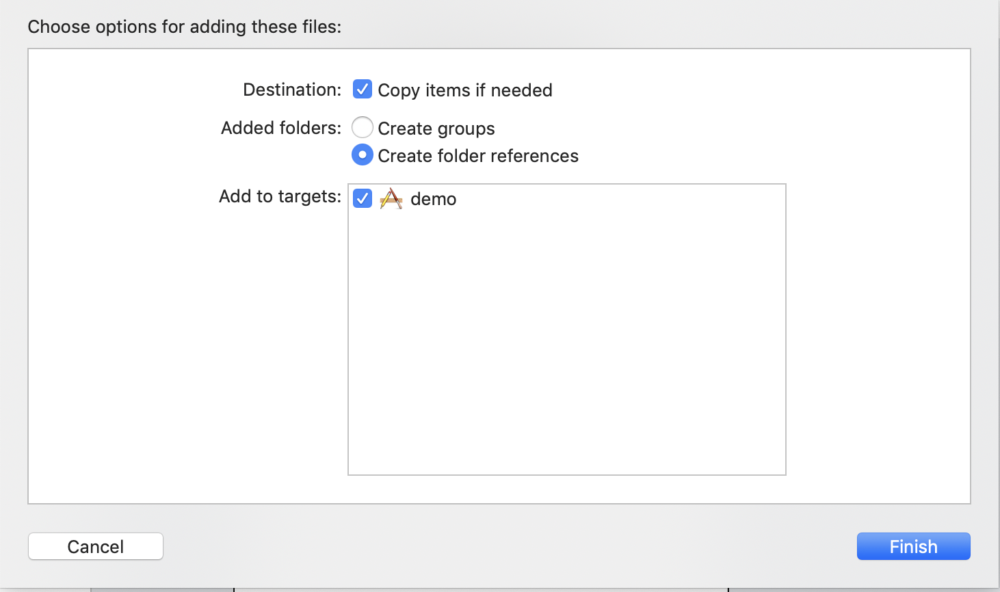

# Adding a Scene to a Storyboard

Add a view controller to a storyboard to manage the display of a scene
in your user interface.

**Steps**

1.  With a storyboard open, drag a View Controller from the Object
    library to the storyboard canvas.

    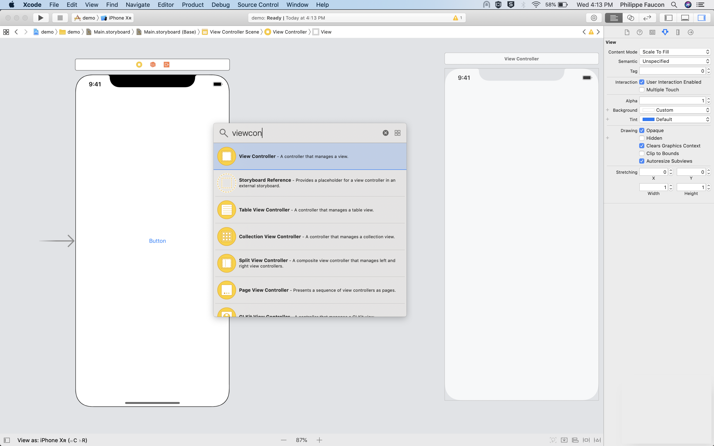

2.  \*Optional\* If you want to be able to customize the behavior of the
    new scene you will need to create a new custom view controller
    class.

    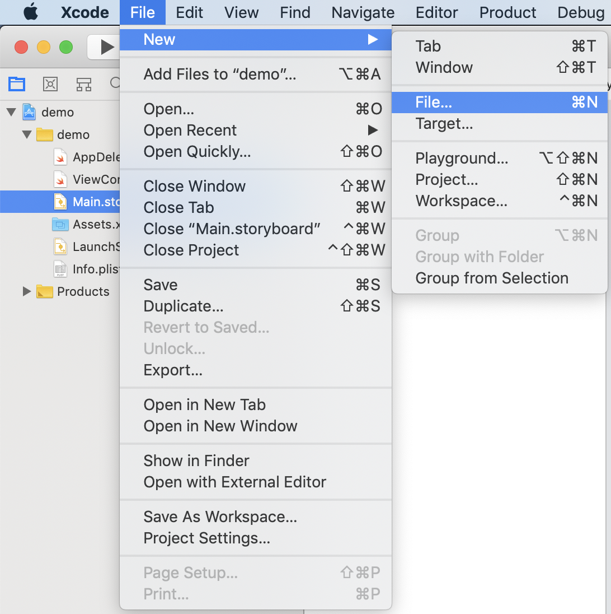
    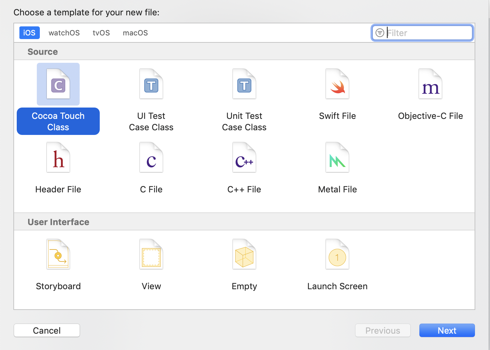
    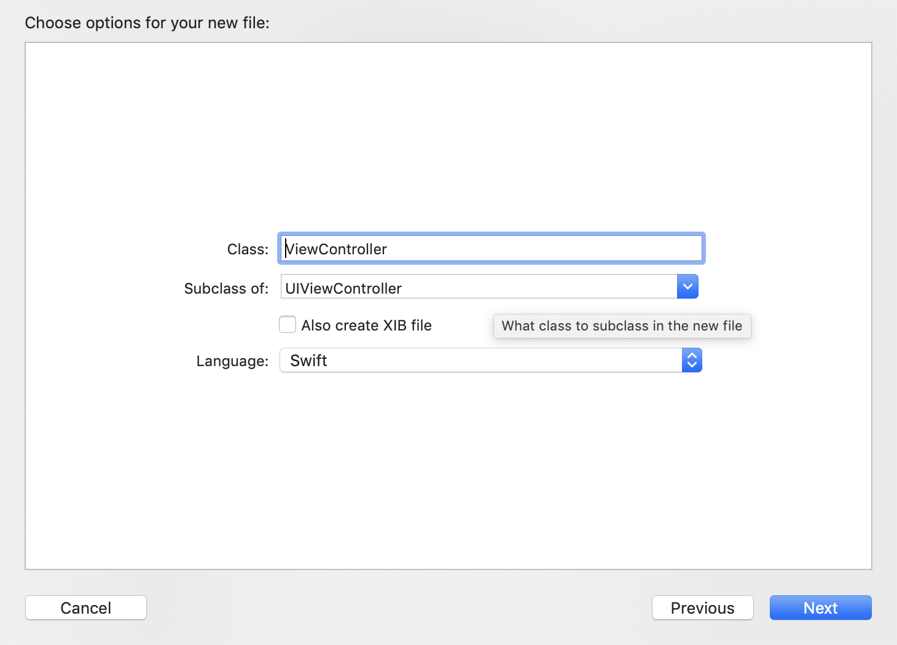

3.  Open the Identity Inspector and set the view controller's custom
    class.

    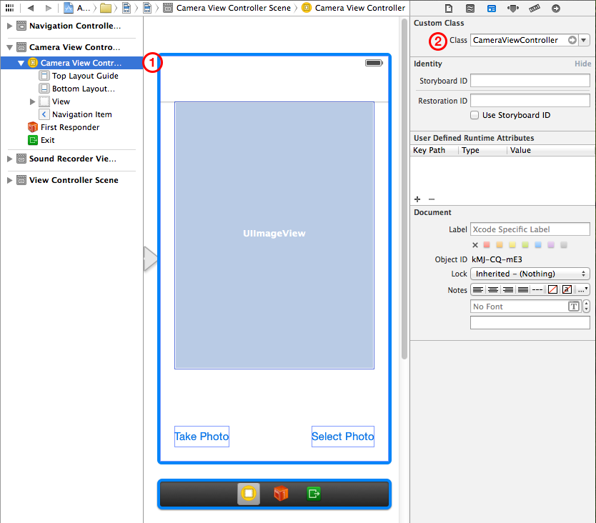

You can add your custom view controller class to the project before you
add the view controller to the storyboard. If you do so, Xcode adds the
name of your custom class to the Class pop-up menu in the Identity
inspector. Alternatively, you could design your entire application flow
before creating any custom view controller classes. After setting the
view controller's custom class, you can use the Attributes inspector to
specify additional custom settings. For example, you can specify whether
the view controller manages the initial scene in the storyboard. After
adding a view controller to a storyboard, you can proceed to lay out the
scene. For example, you might add objects such as controls and text
labels. In a table view, you might select the table view row style; you
might also configure a custom row prototype. Make action and outlet
connections by Control-dragging between an object and the view
controller (icon in the scene dock) or your custom source code.

# Adding a Segue to a Storyboard

Add a segue to a storyboard to specify a transition from one scene to
another. Control- dragging between two scenes creates a segue. The
object you drag from in the first scene is often a button or a table
view cell.

**Steps**

1.  With a storyboard open, Control-drag from an object in one scene to
    another scene

2.  In the menu that appears, choose the style for the new segue.

    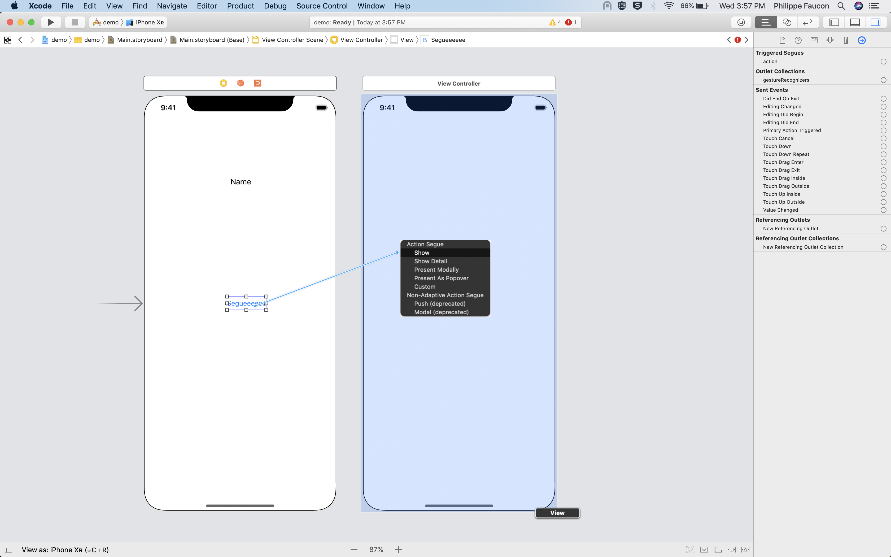

3.  Select the segue. In the Attributes Inspector, fill in the segue
    identifier field.

    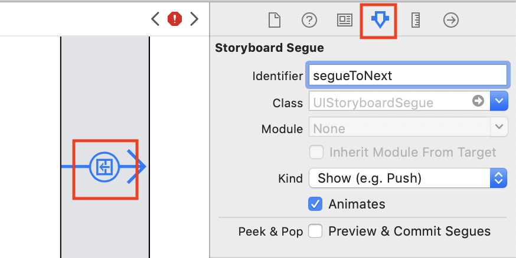

<!-- # Clearing Storyboard connections -->

# Connecting a Delegate or Data Source

Delegates are commonly used when one view needs to be highly
configurable, with behavior that cannot be known in all instances. Data
sources are commonly used when a view needs to be highly reusable and
should not own the data that it is presenting.

**Steps**

1.  With a storyboard open, Control-drag from the vView that needs a
    delegate to the View Controller connection. This can be seen in the
    image below as eith a delegate or data source connection is being
    made from the Table View to the View Controller. Both connections
    can be mapped to the same object (a View Controller can act as both
    the delegate and the data source of a view, or multiple views).

    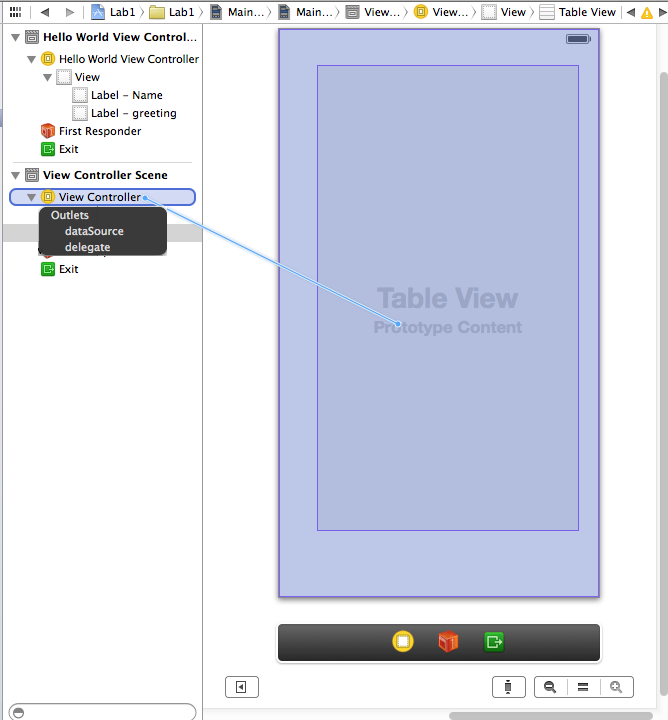

# Creating an Action Connection

Create an action connection to send a message from a control to your
code. When the user clicks a button control, for example, the button
should send an action message telling your code to execute an
appropriate action.

**Steps**

1.  select a storyboard file in the Project Navigator

2.  in the Interface Builder, select the user interface object that you
    would like to access from the program code. The user interface
    object can be any object defined in the storyboard, such as a label,
    button, text view, map view. Objects can either be selected by
    clicking on their storyboard representation, or selecting them from
    the document outline

3.  Switch to the assistant editor

    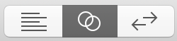

4.  To create the connection ctrl+click-drag from the object in the
    Interface Builder to the implementation where you want to create the
    connection, and then release. After releasing the mouse you will
    have the option to create an action.

    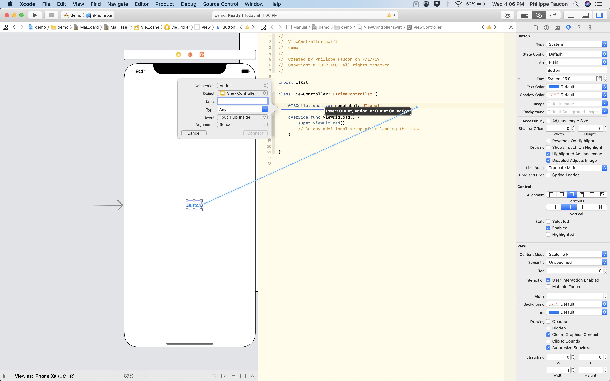

5.  Ensure that the type of Connection is set to "Action\".

6.  Type the name of the new action and connect. It is common in iOS
    programming to choose a method name that explains what a action
    source will do. For example a button which causes a greeing to
    appear may be named "sayHello\".

# Creating an Outlet Connection

To enable your code to send messages to a user interface object (telling
a label to display a text string, for example, or telling a button to
appear or disappear), create a connection from the user interface object
to an outlet in your code.

**Steps**

1.  select a storyboard file in the Project Navigator

2.  in the Interface Builder, select the user interface object that you
    would like to access from the program code. The user interface
    object can be any object defined in the storyboard, such as a label,
    button, text view, map view. Objects can either be selected by
    clicking on their storyboard representation, or selecting them from
    the document outline

3.  Switch to the assistant editor

    

4.  To create the connection ctrl+click-drag from the object in the
    Interface Builder to the interface where you want to create the
    connection, and then release. After releasing the mouse you will
    have the option to create an outlet.

    

5.  Depending on the type of object being connected you may be able to
    change the type of Connection, ensure that this is set to "Outlet\".

6.  Type the name of the new outlet and connect. It is common in iOS
    programming to provide a name that explains what an outlet is; a
    label might be "exampleLabel\", while a button may be
    "secondExampleButton\".

# Creating a New Project

Projects are special constructs that help to manage files related to the
contruction of your apps. Xcode files store storyboard (UI) files,
header and source files (program code), and supporting files (images,
sounds, and extra configuration files). Creation of a project is really
the first step developing an app, and there a number of templates that
can be used to speed up development of your application.

**Steps**

1.  With XCode open select "File" &rarr; "New" &rarr;
    "Project\"

    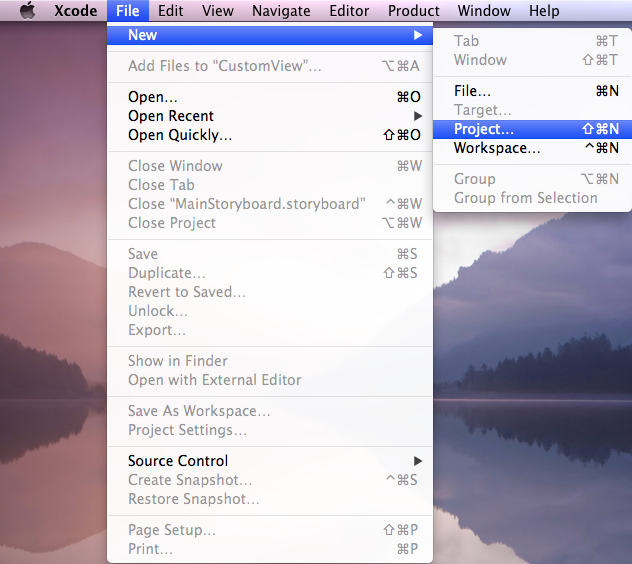

2.  This view presents some of the project templates that are available,
    Single View Application is one of the simpler templates but it
    provides all the bare necessities.

    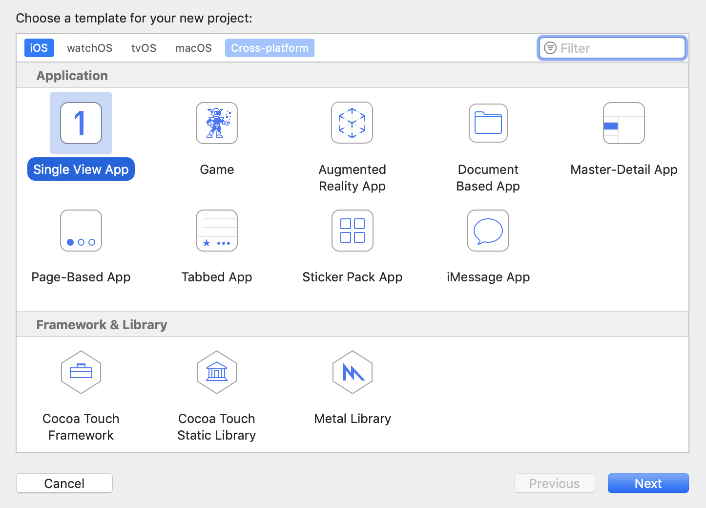

3.  The project needs to know a few key features:

    -   We need to give the App a name, like "Lab1", for our first lab

    -   We should provice a company identifier. iPhone Apps use the
        "reverse domain name" style for identifying authors; so our
        company identifier for the app camp is edu.asu.

    -   The language should be set as Swift, Objective-c is used for older projects, but we won't use it in the camp

    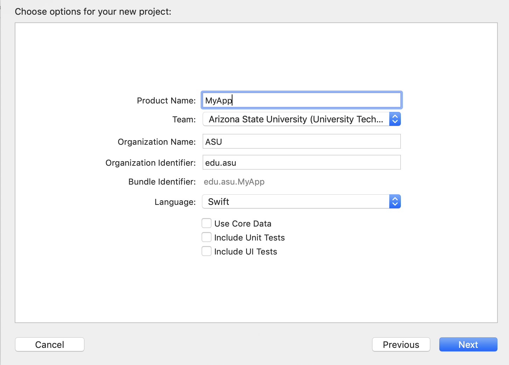

# Looking up Documentation

One of the most important parts to being a good mobile app designer is
the ability to find and understand documentation. While designing apps
you will realize that there are tons of free and powerful software
packages that can make your life much easier, by being able to use these
effectively you will become a far more powerful and efficient designer.
Within Xcode there is excellent documentation for Apple's classes
(program code, not classroom classes), and it's easy to access!

**Steps**

1.  In the Utilities pane switch to the Quick Help inspector

    

2.  In the storyboard select the object that you would like to learn
    more about, the view can be selected from either the Document
    Outline or the Scene that an object appears in. The description
    provides a short explanation of the object, but often it can be
    beneficial to access the Reference or Guides for an object, these
    are also accessible from the Quick Help.

    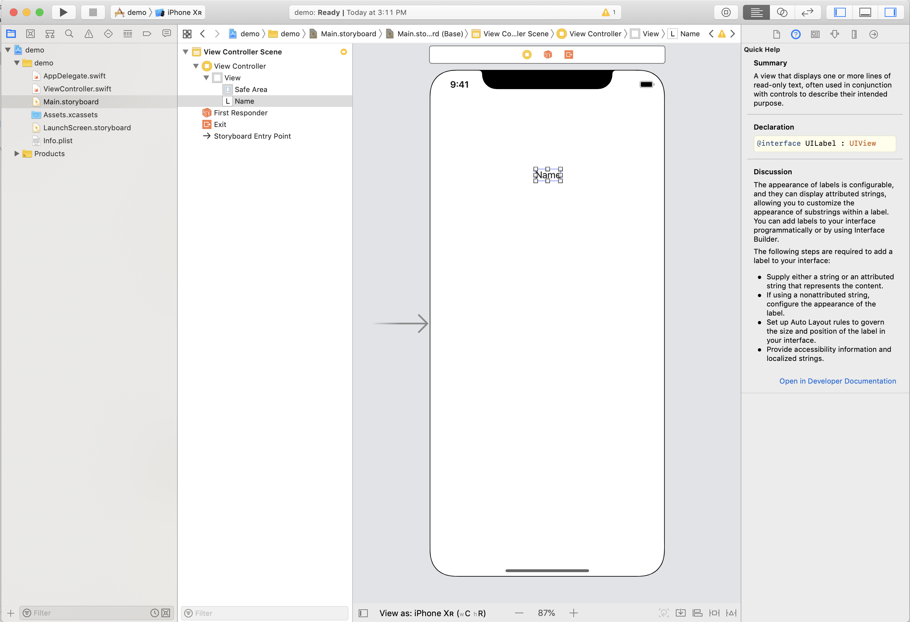

3.  In the program code you can also select an object that you would
    like to know about. One trick for this is that you should select the
    name of the Class and not the name of the Object. For example, in
    the line below selecting "nameField\" will not tell you anything,
    but selecting "UILabel\" will bring up the Quick Help for UILabels:

    \@property IBOutlet UILabel \*nameField;
 
    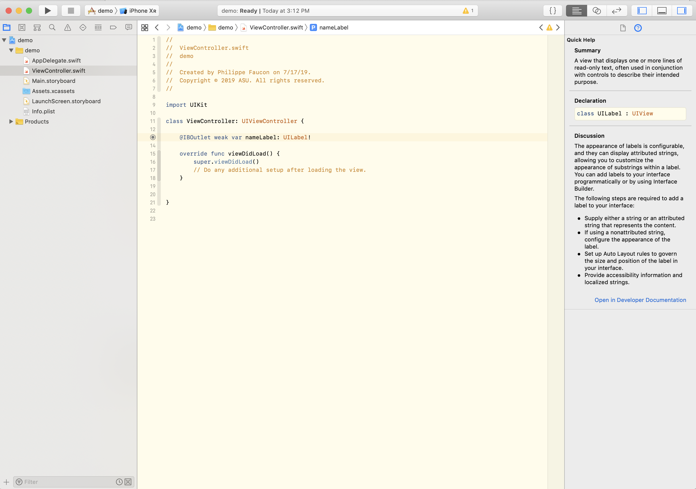
