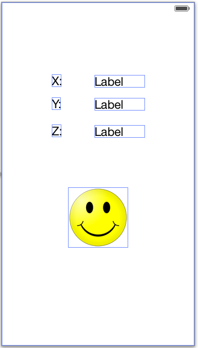

Fun With the Accelerometer
==========================

Goals of this Lab!
------------------

-   Using the accelerometer.

-   Using <tt>NSTimer</tt>.

-   Intro to update-based coding.

The end result should look something like this:


Getting Started
---------------

The first thing we'll need to do is create our project! Create a new
program with the name <tt>AccelerometerGame</tt> and implement the
same settings we have been using.

In the project settings disable all of the orientations except for
portrait (if the screen rotates and the axes change then it will cause
problems for us). To do this select your project settings (image below,
\#1), then under <tt>General</tt> settings, in the <tt>Deployment
Info</tt> area deselect <tt>Device Orientation</tt>s other than
\"Portrait\", like in the screenshot below:


What Will the Accelerometer Give Us?
------------------------------------

It's always good to know what tools you will be using before you get
started. In this case we will be utilizing an accelerometer, which can
detect acceleration in 3 dimensions, 'x', 'y' and 'z'. Now here is an
important question: if our device is not accelerating relative to us (we
don't see it moving in any way) what will the accelerometer tell us? To
answer this question, and the question of what the x, y, and z axes are
all about let's perform a coding experiment!

### Build the UI

Here we will build the layout. It will be a very simple application, we
just need to drag out 6 <tt>label</tt>s. 3 of the labels will say
\"x:\",\"y:\", and \"z:\" with static text, the other 3 will be used to
update the readings in the respective directions. You can lay them out
like the image below:


### Connect to the Backing Code

Next we will want to connect the 3 unnamed labels to the backing code.
Open up the <tt>Assistant Editor</tt> and connect these (ctrl+click
and drag). Create 3 properties that we can use to change the values of
the labels. The names that we use are <tt>xlabel</tt>,
<tt>ylabel</tt>, and <tt>zlabel</tt>. In this example we
connected our properties to the
<tt>AccelerometerGameViewController</tt> file.

### Using the Accelerometer

Now that we have our interface configured we just need to retrieve the
actual values and put them where we want them! The accelerometer
utilizes a framework named <tt>Core Motion</tt> so we will need to
import this framework, and we will also need to add a few properties to
for the <tt>CoreMotionManager</tt>, and an <tt>NSTimer</tt>. In
<tt>AccelerometerGameViewController</tt> update your imports to the
following:

import CoreMotion //add this

class ViewController: UIViewController

\@IBOutlet weak var xLabel: UILabel! \@IBOutlet weak var yLabel:
UILabel! \@IBOutlet weak var zLabel: UILabel!

//add the properties below var accelerometerUpdate = NSTimer(); var
motionManager = CMMotionManager();

Next we will need to create an instance of the
<tt>MotionManager</tt>, and our timer. We will do this configuration
in the <tt>viewWillAppear:</tt>, which will cause fewer changes down
the road. In your <tt>AccelerometerGameViewController</tt> file
create the <tt>viewWillAppear:</tt> method as below (the name should
auto-complete):

```swift
override func viewWillAppear(_ animated: Bool) {
        super.viewWillAppear(animated)
        
        self.motionManager = CMMotionManager()
        self.motionManager.accelerometerUpdateInterval = 0.1 //0.1 second interval between updates
        self.motionManager.startAccelerometerUpdates()
        
        self.accelerometerUpdate = Timer.scheduledTimer(timeInterval: 0.1, target: self, selector: #selector(update(timer:)), userInfo: nil, repeats: true)
        
        print("Finished appearance")
    }
```

Now that we have a timer calling our <tt>update:</tt> method we need
to define what it should do. The main goal is going to be changing the
values of the labels so they reflect the reading from the accelerometer
so we can figure out what the x, y, and z axes are. In our update method
we would like to print the current accelerometer values to the screen,
let's define it now:

```swift
 @objc func update(timer: Timer) {
        
        //get the current accelerometer data
        if let accelerometerData = self.motionManager.accelerometerData {
            
            //print the accelerations on the x, y, and z axis in the respective labels
            self.xLabel.text = String(format: "%0.4f", accelerometerData.acceleration.x)
            self.yLabel.text = String(format: "%0.4f", accelerometerData.acceleration.y)
            self.zLabel.text = String(format: "%0.4f", accelerometerData.acceleration.z)
           
           // We will add more here later
        }
    }
```

Give the application a whirl and see how it runs! From here we can
answer our questions from before, do we get an accelerometer reading
when the device isn't changing position or velocity (relative to us)?
What do the x,y, and z directions mean to the device? More immediately
importantly, how can we use the x, y, and z directions to make something
\"fall\" on the screen?

Let's Get Our Game On!
----------------------

Ok, so reading the accelerometer is great and fine, but we want to USE
the accelerometer!

### Update the UI

Let's first make an object that we can allow to fall; from the resources
pack add the smiley-face image to the project (or get an image from the
web). On the <tt>storyboard</tt> drag out a <tt>Button</tt>. In
the <tt>Attributes Inspector</tt> set its <tt>Image</tt>
property to be the image that you included. Most likely the image will
be HUGE, so go into the <tt>Size Inspector</tt> (ruler icon) next,
and change the <tt>width</tt> and <tt>height</tt> to be around
100. Your storyboard should look something like the image below:



### Connect the Backing Code

Connect the button to the backing code with a new <tt>property</tt>
(not an action) named \"imageButton\".

### We Like to Move it, Move it

Now that we have our image we would like it to respond to gravity. As
some of you who have taken physics may know there are 3 main features
that we are going to have to consider:

-   Position (where is the image)

-   Velocity (how fast is the image moving)

-   Acceleration (how fast is the velocity changing)

We know the position, and we can read the acceleration, but how can we
get the velocity? Acceleration is the change in velocity over time, so
we can use the acceleration readings to calculate a velocity, and we can
use the velocity to change the position! If this doesn't make sense to
you just flag down one of the helpers and we'd be happy to explain in
more detail.

To manage our velocity we are going to create 2 new float
<tt>properties</tt> named <tt>xVelocity</tt> and
<tt>yVelocity</tt> in our class:

class ViewController: UIViewController

// \... everything above can stay

var xVelocity : CGFloat = 0; var yVelocity : CGFloat = 0;

Next we will want to make sure that we update our velocity and position
whenever our acceleration is updated. One simple solution for this is to
put all of our update code into the update method we have defined
already. We will need to add 2 new features:

-   Update the velocity with the accelerometer reading, and

-   Update the position with the calculated velocity.

Add the new code to the <tt>update:</tt> method like below:

```swift
 @objc func update(timer: Timer) {
        
    //get the current accelerometer data
    if let accelerometerData = self.motionManager.accelerometerData {
        
        //print the accelerations on the x, y, and z axis in the respective labels
        self.xLabel.text = String(format: "%0.4f", accelerometerData.acceleration.x)
        self.yLabel.text = String(format: "%0.4f", accelerometerData.acceleration.y)
        self.zLabel.text = String(format: "%0.4f", accelerometerData.acceleration.z)
        
        //update the velocity
        self.xVelocity = self.xVelocity + CGFloat(accelerometerData.acceleration.x * 0.1)
        self.yVelocity = self.yVelocity - CGFloat(accelerometerData.acceleration.y * 0.1)
        
        //update the position
        let center = self.imageButton.center
        let destx = center.x + self.xVelocity * 0.1
        let desty = center.y + self.yVelocity * 0.1
        
        //set the updated position
        let dest = CGPoint( x: destx, y: desty)
        self.imageButton.center = dest
    }
}
```

Give the code a test-run and you should be able to see your smiley
flying around the screen! Oh noooo, it's difficult to recover him if he
falls off the screen, maybe we can build a box to ensure that he doesn't
fall off the screen!

Setting Boundaries
------------------

The next important step is going to be defining our boundaries, we can
pick any arbitrary boundary but some will definitely be easier to
enforce. We could allow the image to fall slightly off the screen, or
perhaps to almost reach the corner of the screen (but fall short by a
few points). On the other hand if we make the boundary exactly the
screen boundary we already have a bounding rectangle defined for us!

### Yup, That's a Wall

The first step is going to be detecting a collision, and being able to
respond to it. Thankfully this is super easy for us! In the
<tt>update:</tt> method add the new collision detection code at the
bottom:

```swift
    // ... everything above should remain

    // check for collisions, is the image completely contained within our view? 
    // if not then it must have left our view (off screen)
    if !(self.view.frame.contains(self.imageButton.frame)) {
        print("Bump")
    }

```
Give that code a run, you should see a steady stream of
<tt>Bump!</tt> messages coming as soon as our image begins to exit
the scene. Now let's modify the code to ensure that our boundary behaves
like one!

### You Shall Not Pass!

We want to make sure that our wall is behaving like a wall, and we'll
need some code to achieve that. What does that entail? We know there is
a collision, but we're not sure which wall we collided with, so we
should figure that out. We'll also need to modify our velocity, and
maybe our position (to give it a real \"bounce\" feeling). That sounds
like a lot of comparisons and code, we'll need a good place to put it.

The obvious choice is to add the code to our update: method, since it is
already detecting the collision anyways, right? This is an important
design decision though; software engineering practices say that every
method should have one job (see: not two), so we want to ensure that our
update method stays simple, let's instead make a
<tt>enforceBoundary</tt> method that will handle the collisions.
Define this new method, and take a look at what each step is doing. In
particular, try to imagine each case you might encounter (what happens
our image leaves the boundaries slightly? What happens if our image is
WAY out of the boundaries? What happens if our image remains in the
boundary?).

```swift
func enforceBoundary() {
    //find out where our image is trying to go
    let center = self.imageButton.center;
    var destx = center.x;
    var desty = center.y;
    
    //how big is our image?
    let xRadius = self.imageButton.frame.size.width/2;
    let yRadius = self.imageButton.frame.size.height/2;
    
    //are we trying to leave the "left" side?
    if (destx - xRadius < 0) {
        
        //make sure that the center of the image would be one radius distance
        //from the edge
        destx = self.imageButton.frame.size.width/2;
        
        //invert the velocity to simulate a bounce
        self.xVelocity = -self.xVelocity;
    }
    
    if (destx + xRadius > self.view.frame.size.width) {
        destx = self.view.frame.size.width - xRadius
        self.xVelocity = -self.xVelocity
    }
    
    if (desty - yRadius < 0) {
        desty = self.imageButton.frame.size.height/2;
        self.yVelocity = -self.yVelocity
    }
    
    if (desty + yRadius > self.view.frame.size.height) {
        desty = self.view.frame.size.height - yRadius
        self.yVelocity = -self.yVelocity
    }
    
    //reconstruct the image location and move the image to that point
    let dest = CGPoint( x: destx, y: desty)
    self.imageButton.center = dest
}
```

One really cool feature about this code is that it will only have an
effect if our image is outside of the boundaries. So we don't need to do
any checking in the <tt>update:</tt> method, we just need to call
this method. As a final step let's modify the <tt>update:</tt>
method to account for this change:

```swift

@objc func update(timer: Timer) {
    
    //get the current accelerometer data
    if let accelerometerData = self.motionManager.accelerometerData {
        
        //print the accelerations on the x, y, and z axis in the respective labels
        self.xLabel.text = String(format: "%0.4f", accelerometerData.acceleration.x)
        self.yLabel.text = String(format: "%0.4f", accelerometerData.acceleration.y)
        self.zLabel.text = String(format: "%0.4f", accelerometerData.acceleration.z)
        
        //update the velocity
        self.xVelocity = self.xVelocity + CGFloat(accelerometerData.acceleration.x * 0.1)
        self.yVelocity = self.yVelocity - CGFloat(accelerometerData.acceleration.y * 0.1)
        
        //update the position
        let center = self.imageButton.center
        let destx = center.x + self.xVelocity * 0.1
        let desty = center.y + self.yVelocity * 0.1
        
        //set the updated position
        let dest = CGPoint( x: destx, y: desty)
        self.imageButton.center = dest
        
        // check for collisions, update if necessary
        self.enforceBoundary();
    }
}
```


Polish and Swagger
------------------

Great job on completing this lab! If you have time and want to build on
this solution to do even more cool things here are a few ideas for
activities:

-   The image has a very clunky bounce. If you notice, sometimes when
    the image hits the edge of the screen it seems that the first
    position update isn't quite right. Essentially the image is trying
    to move to a position like -3, and we put it at 0. If it truly
    bounced it would probably be at a location closer to +3, can you
    make a modification to achieve this?

-   Real objects typically undergo forces like friction, or elasticity
    in collisions. Can you modify the code so that our image loses some
    fraction of its velocity at every time step, and also loses some
    velocity when it bounces? What happens when the friction in the
    \"x\" direction doesn't match the friction in the \"y\" direction?

-   Our image (if you used the smiley) is a circle. But our collision
    region is a square, can you modify the code so that collisions are
    only detected on the actual image?

-   Can you modify the bounding box so that the image is more or less
    restricted?

-   Can you build a small maze where the image could possibly leave but
    only if you find the right path? This might be easier to do by
    adding extra elements onto the screen

-   What happens when you modify the frequency of the
    <tt>NSTimer</tt>? Can you counteract this feature so that no
    matter how frequently you are called you will always move
    approximately the same amount?
