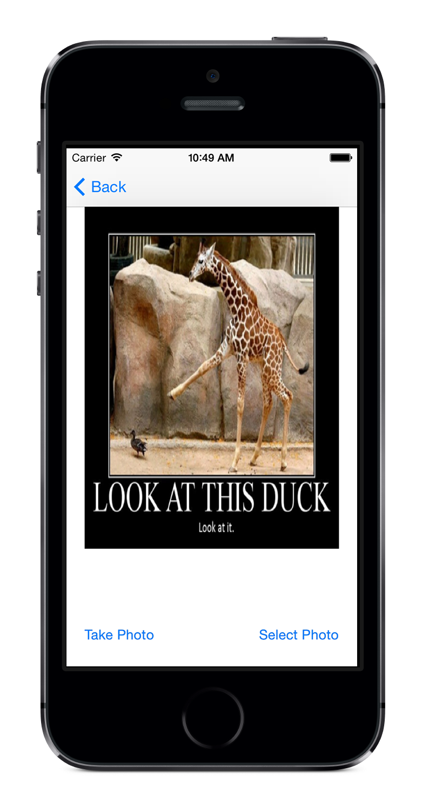
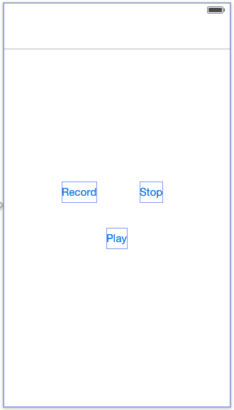

Using the Camera and Microphone
===============================

Goals of this Lab!
------------------

In this app we will be learning about the <tt>
UIImagePickerController</tt>, and using it to take pictures. We will
also learn about audio sessions and using them to record and play back
sounds. This lab will build on the accelerometer lab that was completed
previously. The end result of the lab will be the following screens:

 

Getting started
---------------

Because we are building upon the accelerometer application we don't need
to use Xcode to create a new project. To begin, make a copy of the
accelerometer lab (the entire folder that contains the <tt>
.xcodeproj</tt> file). We are going to be editing this copy of the
accelerometer code.

Changing the Image
------------------

Smiley-faces are super cool and all, but wouldn't it be great if we
could take pictures of whatever we want and use them instead? That's
what we'll be doing in this subsection, and we will make use of the
<tt> UIImagePickerControllerDelegate</tt>.

### Add a View Controller

The first thing we want is a new view controller that can handle the
picture taking, and a way to get there. In the <tt>storyboard</tt>
drag out a new <tt>View Controller</tt> object. On this new view
controller add:

-   1 <tt>Image View</tt>

-   2 <tt>Buttons</tt>

The buttons will be used to determine where we are getting the photo
from, one will take a photo from the camera, and another will use the
camera roll (the photos already on the device). You can name the buttons
however you feel makes the most sense, but we like the names <tt>Take
Photo</tt> and <tt>Select Photo</tt>.

Once the photo buttons are created you'll need to select the view
controller, and in the <tt>Attributes Inspector</tt> select the
<tt>Is Initial View Controller</tt> checkbox. This will ensure that
we default to this scene, and we can test that everything is working
later on. After this step your storyboard should have a new view
controller that looks like this:


### Connect the ViewController

Now we will need some code that can control the storyboard view
controller. Add a new file named <tt>CameraViewController</tt> that
is a subclass of <tt>UIViewController</tt>. Select the
<tt>CameraViewController</tt> and then change the <tt>Class</tt>
in the <tt>Identity Inspector</tt>. If you don't see the
<tt>Document Outline</tt> tap the small play button in the bottom
left corner of the storyboard.


Next we will want to define a few outlets so that the code can interact
with the user interface. We're going to define some outlets and actions,
so let's open the <tt>Assistant Editor</tt>. We are going to need:

-   1 action from the <tt>Take Photo</tt> button named
    <tt>takePhoto</tt>

-   1 action from the <tt>Select Photo</tt> button named
    <tt>selectPhoto</tt>

-   1 property for the <tt>UIImageView</tt> named
    <tt>imageView</tt>

Remember that when you ctrl+click and drag a button default definition
in the popover may be for a property, but we want an action.

### Add the Code

In the <tt>CameraViewController</tt> file we are going to have to
complete the <tt>takePhoto</tt> and <tt>selectPhoto</tt> methods
like below. These methods should have been added when you linked the
storyboard view controllers, so you should just be adding the content:

```swift
// Take photo action from the storyboard.
@IBAction func takePhoto(sender: UIButton) {
    if UIImagePickerController.isSourceTypeAvailable(UIImagePickerController.SourceType.camera) {
        let picker = UIImagePickerController()
        picker.delegate = self
        picker.allowsEditing = true
        picker.sourceType = UIImagePickerController.SourceType.camera
        
        present(picker, animated: true, completion: nil)
    }
    else {
        print("Oh noes, the camera doesn't work on the simulator!")
    }
}

// Select photo action from the storyboard.
@IBAction func selectPhoto(sender: UIButton) {
    if UIImagePickerController.isSourceTypeAvailable(UIImagePickerController.SourceType.savedPhotosAlbum) {
        let picker = UIImagePickerController()
        picker.delegate = self
        picker.allowsEditing = true
        picker.sourceType = UIImagePickerController.SourceType.savedPhotosAlbum
        
        present(picker, animated:true, completion: nil)
    }
}
```
This will cause a <tt>UIPickerView</tt> to use the screen modally,
and once it has completed it will tell its delegate (us) that it is
finished. To handle this information we will need to implement the
protocol, and the two delegate methods that will be called.

To tell the compiler that we intend to support the two protocols that
the <tt>UIImagePickerController</tt> wants to use, we need to change
a few things. To make this change update the definition of the class
line to be the following:

```swift
class CameraViewController: UIViewController, UIImagePickerControllerDelegate, UINavigationControllerDelegate {
```

Then implement the required methods in
<tt>CameraViewController</tt>:

```swift
// Call this function when an image picker operation is done.
func imagePickerController(_ picker: UIImagePickerController, didFinishPickingMediaWithInfo info: [UIImagePickerController.InfoKey : Any]) {
    
    guard let chosenImage = info[.editedImage] as? UIImage else {
        return
    }
    self.imageView.image = chosenImage
    picker.dismiss(animated: true, completion: nil)
}

// Call this function when an image picker operation is cancelled.
func imagePickerControllerDidCancel(_ picker: UIImagePickerController) {
    picker.dismiss(animated: true, completion: nil)
}
```


One last step that we will want to do is to ensure that our navigation
bar is returned once we have everything linked back up. To do this we'll
have to add the line below to our <tt>viewDidLoad</tt> method as
shown below:
```swift
override func viewDidLoad() {    
    super.viewDidLoad()
    self.navigationController?.setNavigationBarHidden(false, animated: true)
}
```

### Test it Out

At this point we should be able to use the <tt>UIImagePicker</tt> to
choose an image either from the camera roll, or from the active camera.
Test these features to make sure that both of them work before moving
on\... But first, let's take a selfie!

Sound Off, One Two
------------------

In this subsection we will be integrating the <tt>AVFoundation</tt>
framework into our application so that we can play and record arbitrary
sounds. To accomplish this feat we will be creating a new view
controller, and a new model class that can handle the storage and
playing of sounds.

### Add a View Controller

We're going to create a new view controller that can handle recording
and playing audio. In the storyboard drag out a new <tt>View
Controller</tt> for us to use. On this new view controller add 3
<tt>Button</tt>s.

The buttons will be used to start a recording, finalize a recording, and
to play back a recording. Again you can name the buttons however you see
fit, but we used the names <tt>Record</tt>, <tt>Stop</tt>, and
<tt>Play</tt>. We will also want to start on this view controller so
we can work on this code, in the <tt>Attributes Inspector</tt>
select the <tt>Is Initial View Controller</tt> checkbox. After this
step your storyboard should have a new view controller that looks like
this:



### Connect the View Controller

Now we will need some code that can allow the view controller to react
to events. You know the drill! Add a new file named
<tt>SoundRecorderController</tt> that is a subclass of
<tt>UIViewController</tt>. In the storyboard make sure that you
assign the code to back the view controller like we have done before
(and in the image below):


Next we are going to create a property and an action for each button
(the properties will allow us to modify the button behavior during
recording). Open the <tt>Assistant Editor</tt> and make the
following connections:

-   1 action from the <tt>Record</tt> button named
    <tt>recordPauseTapped</tt>.

-   1 action from the <tt>Stop</tt> button named
    <tt>stopTapped</tt>.

-   1 action from the <tt>Play</tt> button named
    <tt>playTapped</tt>.

-   3 properties named <tt>recordPauseButton</tt>,
    <tt>stopButton</tt>, and <tt>playButton</tt>.

### Add the Code

If you run the program now you should see our new view controller with 3
buttons that currently do nothing. Now we're going to make our app sing!

### Configuring the Audio Session

Before doing any more coding we are going to finish up our file by
declaring our support for some delegation protocols (which we will talk
about later), and some properties to help us with audio recording and
playback. In the <tt>SoundRecorderViewController</tt> file add the
following code:

```swift
import UIKit
import AVFoundation

class SoundRecorderViewController: UIViewController, AVAudioRecorderDelegate, AVAudioPlayerDelegate {

    @IBOutlet weak var recordPauseButton: UIButton!
    @IBOutlet weak var stopButton: UIButton!
    @IBOutlet weak var playButton: UIButton!
    
    var recorder: AVAudioRecorder!
    var player: AVAudioPlayer!
```

The <tt>AVAudioRecorder</tt> class allows us to record sound in iOS
very easily. To use it we only have to set up a few things:

-   Specify a sound file URL (where will our sound be saved),

-   Set up an audio session (what sound activities will we be doing?),
    and

-   Configure the <tt>AVAudioRecorder</tt> with the format we want
    to record and the sampling rate.

To handle this initialization we are going to use the
<tt>viewDidLoad</tt> method. Since the <tt>viewDidLoad</tt>
method is called before the scene is shown on screen we can assume that
we'll be ready to record by the time the user is able to ask us to
record. Update the <tt>viewDidLoad</tt> method in
<tt>SoundRecorderViewController</tt> with the following, also add
the <tt>getAudioURL</tt> helper method:

```swift
override func viewDidLoad() {
    super.viewDidLoad()
    self.navigationController?.setNavigationBarHidden(false, animated: true)
    
    // Disable Stop/Play buttons when application launches.
    self.stopButton.isEnabled = false
    self.playButton.isEnabled = false

    // Set up audio session.
    let session = AVAudioSession.sharedInstance()
    do {
        try session.setCategory(.playAndRecord, mode: .default)
    }
    catch {
        print("Failed to initialize recording session.")
    }
    
    // Define the recorder setting.
    let recordSetting = [
        AVFormatIDKey: Int(kAudioFormatMPEG4AAC),
        AVSampleRateKey: 44100.0,
        AVNumberOfChannelsKey: 2 as NSNumber,
        ] as [String : Any]
    
    // Set the audio file.
    let outputFileURL = getAudioURL()
    
    // Initialize and prepare the recorder.
    do {
        recorder = try AVAudioRecorder(url: outputFileURL as URL, settings: recordSetting)
        recorder.delegate = self
        recorder.isMeteringEnabled = true
        recorder.prepareToRecord()
    }
    catch {
        print("Failed to initialize the recorder.")
    }
    
}

// Where are we going to save the recording?
func getAudioURL() -> NSURL {
    
    let pathComponents = NSSearchPathForDirectoriesInDomains(.documentDirectory, .userDomainMask, true) as [NSString]
    let audioFileName = pathComponents[0].appendingPathComponent("MyAudioMemo.m4a")
    return NSURL(fileURLWithPath: audioFileName)
}
```

Great, so that was an excellent copy paste adventure, but what does that
all do? First we do some basic UI configuration; We make sure the
navigation bar is showing, and we disable everything except the record
button (we can play if we have no recording). Next we set up an
<tt>AVAudioSession</tt>, this allows us to tell the device that we
intend to take control of the audio, and specifically that we intend to
play audio, and to record audio.

We then create an <tt>AVAudioRecorder</tt> tell it how and where to
record (what audio compression format do we want, and how many samples
per second would we like, where does the recording go), the recorder
will connect to the session without our interaction (so cool!). There is
a lot more to audio recording if you want to play around with it, but if
you just want to capture audio then you don't need any more
configuration than this.

One of the settings that we give the recorder is the location we want to
save our recording (<tt>getAudioURL</tt>). Here we'll do some hand
waving and say that on the device there is a home directory (like in
your \"My Documents\" folder), we are asking the system for the folder
and in it we are creating a path to a file named
<tt>MyAudioMemo.m4a</tt>. The Audio Recorder will write to this URL
whether or not something is there, so be careful not to accidentally
overwrite files!

### Implementing the Record/Pause Button

We have completed the audio preparation. Let's move on to implement the
action method of the <tt>Record</tt> button. Before we dive into the
code, let's explain how the <tt>Record</tt> button works. When user
taps the <tt>Record</tt> button, the app will start recording and
the button text will be changed to <tt>Pause</tt>. If user taps the
<tt>Pause</tt> button, the app will pause the audio recording until
the <tt>Record</tt> is tapped again.

The audio recording will only be stopped (and saved) when user taps the
<tt>Stop</tt> button. The way that the recording is \"paused\" or
\"stopped\" is totally hidden from us, we don't need to know exactly
what the system is doing. Edit the <tt>recordPauseTapped:</tt>
method with the following code:

```swift
@IBAction func recordPauseTapped(sender: UIButton) {
    
    // Stop the audio player before recording.
    if self.player != nil{
        if self.player.isPlaying {
            self.player.stop()
        }
    }
    
    if !self.recorder.isRecording {
        
        let session = AVAudioSession.sharedInstance()
        do {
            try session.setActive(true)
        }
        catch {
            print("Fail to start recording session.")
        }
        
        // Start recording.
        self.recorder.record()
        self.recordPauseButton.setTitle("Pause", for: .normal)
    }
    else {
        
        // Pause recording.
        self.recorder.pause()
        self.recordPauseButton.setTitle("Record", for: .normal)
    }
    
    self.playButton.isEnabled = true
    self.stopButton.isEnabled = true
}
```

In the above code, we first check if the audio player is playing. If it
is playing we stop it by using the <tt>stop</tt> method. Since this
button is used for both starting and pausing a recording we must next do
a check to see which behavior we should exhibit. If the recorder is not
recording then a user tapping on this button will want to start
recording. If the recorder has already started recording then the user
probably wants to pause a recording.

### Implementing the Stop Behavior

For the <tt>Stop</tt> button, we simply call the <tt>stop</tt>
method on the recorder, this tells our recorder that this recording is
completed, and it should be written to the disk (storage on the phone).
We also set the <tt>audioSession</tt> to inactive so that when the
next app wants to use the session it knows that no one else is using it.

```swift
@IBAction func stopTapped(sender: UIButton) {
        
    self.recorder.stop()
    
    let audioSession = AVAudioSession.sharedInstance()
    do {
        try audioSession.setActive(false)
    }
    catch {
        print("Failed to complete the recording.")
    }
}
```

You can make use of the <tt>AVAudioRecorderDelegate</tt> protocol to
handle audio interruptions (say, a phone call during audio recording)
and the completion of recording. In this case we will only hook into the
completion of a recording, the
<tt>audioRecorderDidFinishRecording:</tt> method is called after the
the <tt>self.recorder.stop()</tt> line has finished processing.

In this case we control both the recorder and the view that is
controlling the recorder, so we already know when the recording is
completed, but in many cases this isn't true. Soon we'll see a case
where one object is playing a sound (through the session), and a second
object is triggering the first object to play. Add the following code:
```swift
 func audioRecorderDidFinishRecording(_ recorder: AVAudioRecorder, successfully flag: Bool) {
    
    self.recordPauseButton.setTitle("Record", for: .normal)
    self.playButton.isEnabled = true
    self.stopButton.isEnabled = false
}
```

This changes the title of the play/record button back to
<tt>Record</tt>, since we are no longer recording. It also enables
the play button (since we have something to play back), and disables the
stop button (since we no longer have anything to stop).

### Playing it Back

Finally, it comes to the implementation of the <tt>Play</tt> button
for audio playback using <tt>AVAudioPlayer</tt>. In
<tt>SoundRecorderViewController</tt>, edit the
<tt>playTapped:</tt> method using the following code:
```swift
@IBAction func playTapped(sender: UIButton) {
    if !self.recorder.isRecording {
        do {
            self.player = try AVAudioPlayer(contentsOf: self.getAudioURL() as URL)
            self.player.delegate = self
            self.player.play()
        }
        catch {
            print("Failed to initialize the player.")
        }
    }
}
```

Here we are creating an audio player and telling it to play audio based
on the URL that we recorded to. This is where using methods is very
effective, if we change the location that we are recording to in one
location then it will change everywhere, leading to fewer errors in our
code.

We can also implement some delegate methods from
<tt>AVAudioPlayer</tt>, like <tt>AVAudioRecorder</tt>. These
methods inform us that the recording has finished playing back. You can
implement the method below to see how we can use the callback to pop up
a simple alert when the playback has completed:

```swift
func audioPlayerDidFinishPlaying(_ player: AVAudioPlayer, successfully flag: Bool) {
    let alert = UIAlertController(title: "Done", message: "Recording completed successfully!", preferredStyle: UIAlertController.Style.alert)
    alert.addAction(UIAlertAction(title: "Ok", style: UIAlertAction.Style.default, handler: nil))
    self.present(alert, animated: true, completion: nil)
}
```

### Test it out

You can test audio recording and playback using a physical device or
software simulator. If you test the app using actual device (e.g.,
iPhone), the audio being recorded comes from the device connected by the
built-in microphone or headset microphone. On the other hand, if you
test the app by using the Simulator, the audio comes from the system's
default audio input device as set in System Preferences.

So go ahead to compile and run the app! Tap the <tt>Record</tt>
button to start recording. Say something, tap the <tt>Stop</tt>
button and then select the <tt>Play</tt> button to listen to the
playback.

Bringing it All Together
------------------------

In this subsection we are going to implement a new <tt>Model</tt>
singleton that is going to help us integrate all of the pieces and bring
our simple game together. In particular we would like to allow the user
to choose their own image, which we can select from the
<tt>CameraViewController</tt>; and choose their own sound to play
when a \"bounce\" occurs, which we can select from the
<tt>SoundRecorderViewController</tt>!

### Creating Connections

The first step to making out view controllers work together is creating
segues between them, and adding a navigation controller. To do this,
embed the <tt>accelerometerViewController</tt> in a <tt>Navigation
Controller</tt>, then set that <tt>Navigation Controller</tt> as
the <tt>initial View Controller</tt>. In our case we used the
imageButton as a link to the <tt>Camera View Controller</tt>, and
added a new button that would take us to the <tt>Microphone View
Controller</tt>. You're welcome to think up your own way of linking
the views though.

### Creating the State Model

Here we are going to create our state model singleton, which will
facilitate communication between our other components. A singleton is an
object of which only one can exist, this is particularly useful when
talking about managing configurations, or taking input from the user. We
will use it to store the last sound recording, and the last updated
image.

First, create a new file which will be a subclass of
<tt>NSObject</tt> named <tt>StateModel</tt>. We are going to
create a few properties that will store information regarding the
current configuration of the application. To do this add the following
code:
```swift
import UIKit
import AVFoundation

class StateModel: NSObject, AVAudioPlayerDelegate {
    
    //add these to store the image we are using, and the sound recording/playback tool
    var image: UIImage!
    var recordingURL: NSURL!
    var player: AVAudioPlayer!
    
    //this is a special variable that is used to retrieve the one instance of our StateModel
    static let sharedInstance = StateModel()
```

Next we will update the code in other methods; first we will add the
code that handles making our class a singleton:
```swift
// We can still have a regular init method, that will get called the first time the Singleton is used.
override private init() {
    super.init()
    
    let session = AVAudioSession.sharedInstance()
    do {
        try session.setCategory(.playAndRecord, mode: .default)
    }
    catch {
        print("Failed to initialize session.")
    }
}
```
Next we want to include a custom setter method. This method is called
whenever someone changes the value of one of our our properties:

```swift
// This is a setter to set the URL for the player
func setRecURL(recordingURL: NSURL) {
    self.recordingURL = recordingURL
    do {
        self.player = try AVAudioPlayer(contentsOf: recordingURL as URL)
    }
    catch {
        print("Failed to find the recording!")
    }
    self.player.delegate = self
}
```

\"How does this singleton thing work?\" you ask. That's a great
question! The idea of a singleton is that it is an object where we only
want to have a single instance of it in existence. \"Why would we want
that?\", you ask. You are great with these questions! \"Why am I great
with questions?\", you might ask. \"Stop it :-\", I would reply. As for
why we want a single instance, think about the speakers on a phone,
there is only one hardware controller for the speakers, so if we have
lots of objects fighting for control of the hardware then we have a
recipe for disaster. Alternatively we might have some data that our
entire application would like to share (like a recording, or an image),
and we don't want every component of our system to talk to every other
component (what happens if we want to remove one component later?).
Instead all of the components can talk to one central component, and
then in the future if we don't want to have the camera we can simply
remove the camera.

### Updating the Camera View Controller

Next we will need to update the Camera View Controller. Specifically we
need to tell the <tt>CameraViewController</tt> file that there is a
thing called a <tt>StateModel</tt>, and we would like to be able to
communicate with it. Since we are using Swift, then our
<tt>CameraViewController</tt> already knows that this
<tt>StateModel</tt> exists!

Then to use the <tt>StateModel</tt> we will just set the image that
the <tt>StateModel</tt> is holding every time we change the image
that we are holding. Modify the
<tt>imagePickerController:didFinishPickingMediaWithInfo:</tt>
method:

```swift
// Call this function when an image picker operation is done.
func imagePickerController(_ picker: UIImagePickerController, didFinishPickingMediaWithInfo info: [UIImagePickerController.InfoKey : Any]) {
    
    guard let chosenImage = info[.editedImage] as? UIImage else {
        return
    }
    self.imageView.image = chosenImage
    picker.dismiss(animated: true, completion: nil)
    
    // State model update.
    let model = StateModel.sharedInstance
    model.image = chosenImage
    print(model.image)
}
```

### Updating the Sound Recorder View Controller

In the <tt>SoundRecorderViewController</tt> file we will also need
to inform the <tt>StateModel</tt> about new recordings. We can do
that using the delegate method <tt>audioRecorderDidFinishRecording:successfully:</tt>:

```swift
func audioRecorderDidFinishRecording(_ recorder: AVAudioRecorder, successfully flag: Bool) {
        
    self.recordPauseButton.setTitle("Record", for: .normal)
    self.playButton.isEnabled = true
    self.stopButton.isEnabled = false
    
    // State model update.
    let model = StateModel.sharedInstance
    model.setRecURL(recordingURL: self.getAudioURL())
}
```

### Updating the Game View Controller

Just setting this information doesn't make any change that is noticeable
by the user. To see a change in the game performance we will need to use
this new information!

We will need to make a few changes in
<tt>AccelerometerGameViewController</tt>. First we are going to
ensure that any time we are about to appear on screen we update to the
most recent image. Update the <tt>viewWillAppear</tt> method with
the following code:
```swift
override func viewWillAppear(_ animated: Bool) {
    super.viewWillAppear(animated)
    self.navigationController?.setNavigationBarHidden(true, animated: true)
    
    //load up our image
    let model = StateModel.sharedInstance
    if model.image != nil {
        self.imageButton.setImage(model.image, for: .normal)
    }
    
    //create an accelerometer manager
    self.motionManager = CMMotionManager()
    self.motionManager.accelerometerUpdateInterval = 0.1
    self.motionManager.startAccelerometerUpdates()
    
    //reset velocity to nil so our image starts out at a normal speed
    self.xVelocity = 0
    self.yVelocity = 0
    
    //attach the timer
    self.accelerometerUpdate = Timer.scheduledTimer(timeInterval: 0.1, target: self, selector: #selector(update), userInfo: nil, repeats: true)
    
    //set up the default audio player
    let audioFilePath = Bundle.main.path(forResource: "Boing", ofType: "wav")
    if audioFilePath != nil {
        let audioFileUrl = NSURL.fileURL(withPath: audioFilePath!)
        do {
            audioPlayer = try AVAudioPlayer(contentsOf: audioFileUrl)
            audioPlayer.prepareToPlay()
        }
        catch {
            print("can't create audio player")
        }
    }

}
```

We also want to make sure that we pause any time the game scene isn't
up. The easiest way to do this is to simply remove the timer when we are
leaving the main screen. In the
<tt>AccelerometerGameViewController</tt> file let's hook into the
lifecycle method named <tt>viewWillDisappear</tt>:

```swift
 override func viewWillDisappear(_ animated: Bool) {
    
    super.viewWillDisappear(animated)
    self.accelerometerUpdate.invalidate()
}
```

This code will check if the <tt>StateModel</tt> has an image, if it
doesn't have any image then we won't load from it. If the
<tt>StateModel</tt> does have an image then we will replace our old
image with whatever it is using. The final change is cause our recording
to play whenever we bounce into a wall. Because we have our code
designed so nicely we know exactly where we can put that code\...into
the <tt>bumpedWall</tt> method! We'll need to add a variable that
can tell us if we bumped one of the walls in our
<tt>enforceBoundary</tt> method:

```swift
func enforceBoundary() {
        
        var bump = false
        
        // find out where our image is trying to go
        let center = self.imageButton.center
        var destx = center.x
        var desty = center.y
        
        //how big is our image?
        let xRadius = self.imageButton.frame.size.width / 2
        let yRadius = self.imageButton.frame.size.height / 2
        
        //are we trying to leave the "left" side?
        if destx - xRadius < 0 {
            
            // make sure that the center of the image would be one radius distance
            // from the edge
            destx = self.imageButton.frame.size.width / 2
            
            //invert the velocity to simulate a bounce
            self.xVelocity = -self.xVelocity
            bump = true
        }
        
        if destx + xRadius > self.view.frame.size.width {
            
            destx = self.view.frame.size.width - xRadius
            self.xVelocity = -self.xVelocity
            bump = true
        }
        
        if desty - yRadius < 0 {
            
            desty = self.imageButton.frame.size.height / 2
            self.yVelocity = -self.yVelocity
            bump = true
        }
        
        if desty + yRadius > self.view.frame.size.height {
            
            desty = self.view.frame.size.height - yRadius
            self.yVelocity = -self.yVelocity
            bump = true
        }
        
        //reconstruct the image location and move the image to that point
        let dest = CGPoint(x: destx, y: desty)
        self.imageButton.center = dest
        
        if(bump) {
            
            // when the sound is stored
            if let player = StateModel.sharedInstance.player {
                player.play()
            }
            // else play the dafault sound
            else {
                if audioPlayer != nil {
                    audioPlayer.play()
                }
            }
        }
    }
```

Polish and Swagger
------------------

Congratulations on finishing the activity! Now we can take pictures,
make audio recordings, and even store integrate them into existing
projects (we'll be reusing some of this code in the next activity!).

If you have time and want to build on this solution to do even more cool
things here are a few ideas for activities:

-   By default the <tt>UIImagePicker</tt> uses the rear camera, can
    you switch it to use the front camera? You may want to look into the
    <tt>cameraDevice</tt> property (check the documentation)!

-   If you analyze the microphone recording code you'll notice that we
    use a URL that refers to the file system on the phone. This
    recording is actually stored on the phone, and you can go to the url
    to extract the recording (you can use <tt>print()</tt> to print
    the url). The picture on the other hand is not saved, can you modify
    the code so that it is saved?

-   We enable access to the saved photos album and to taking photos
    directly. There is a way to access the photo library, can you find
    it in the documentation?

-   This one will take quite a bit of time, but can you replace the
    image with an animated gif? Perhaps a PSY, Gangnam Styling with
    gravity?
