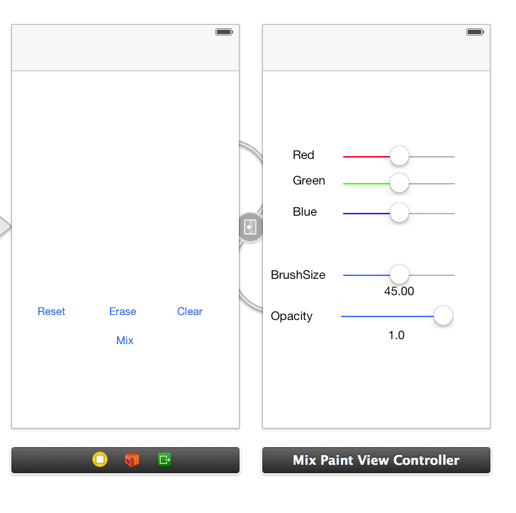
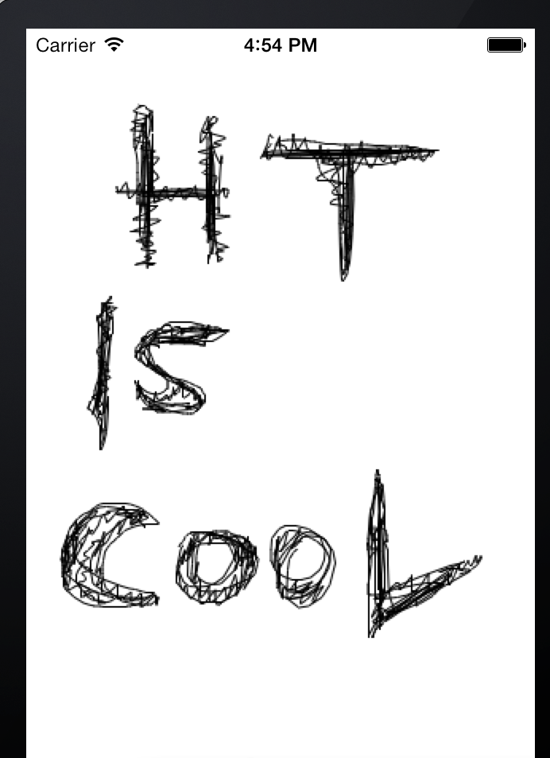
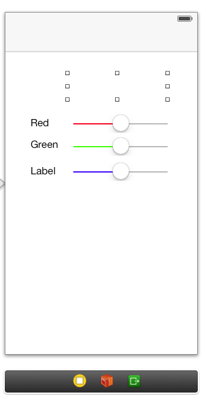
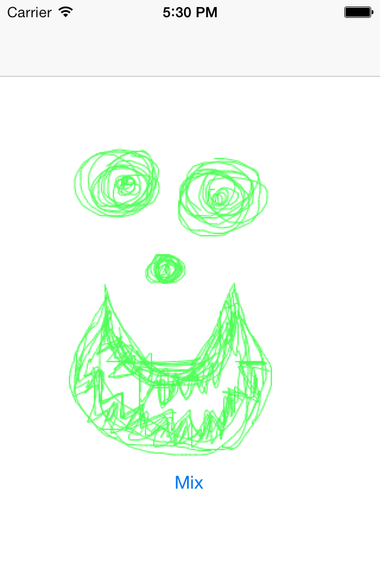
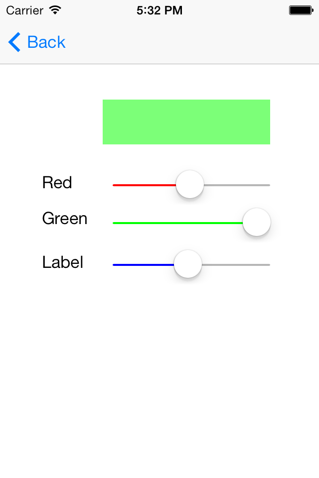

Finger Painting - Responding to User Touches
============================================

Goals of this Lab!
------------------

-   Develop a finger painting app

-   Implementing 2 view controllers

-   Creating a custom <tt>UIView</tt> capable of handling the drawing.

The final product should look like this:



Getting Started
---------------

Create New Project with the following settings:

-   iOS &rarr; Application &rarr; Single View Application
    &rarr; Next

-   Name = FingerPainting

-   Class Prefix = Paint

-   You won't need a git repository, but you're welcome to add one.

Phase I - Do you View What I View?
----------------------------------

In this subsection we will be creating a custom UIView subclass (whoop
whoop!). This view will directly respond to the user touches so that we
can easily paint a picture on our screen.

### Updating the UI

Since we are making a custom _UIView_ we will be doing a lot of the work
from the code side meaning that there really isn't much to change in our
UI just yet. Look at that, made it through a subsection in only 2
sentences and with no work!

### Connecting the PaintView to Program Code

We are going to need to create a new backing class for our view and then
connect it in the storyboard:

-   Create a new Swift file named PaintView and set it as a subclass of
    UIView.

-   Now go to the storyboard and click in the middle of the view
    controller, or on the View object in the Document Outline

-   Go to identity inspector, and the class should say UIView; change it
    to PaintView.

### Writing the Program Code

Now we have our view and it is connected to the backing code but it's
totally empty! It's time to implement all the drawing functionality that
we are so excited about! In PaintView update the code to be the
following:

```swift
import UIKit

class PaintView: UIView {
    var brushColor: UIColor?
    var tempDrawImage: UIImageView? = UIImageView()
    var lastTouch: CGPoint?
}
```

In this next subsection of code we will implement essentially every
other function. Our application will track the movement of a users
finger across the screen, and every so often we will draw a line segment
from where a users finger was up to where it is now. As long as we
update frequently enough the drawing should appear smooth.

In the <tt>PaintView</tt> file add these methods:

```swift
// this method is called automatically when a view is created by the storyboard 
// Almost all this code is standard, it has to be here and doesnt customize anything 
required init?(coder aDecoder: NSCoder){
  super.init(coder: aDecoder) 
  self.configure()
}

// this is a helper method to allow us to set whatever default settings we would like to use
// if you'd like you can even override the .image property to that we have an image at startup
func configure() {
    self.brushColor = UIColor.black
}

// when a user puts a finger on the screen this method is called automatically
    override func touchesBegan(_ touches: Set<UITouch>, with event: UIEvent?) {
        let touch = touches.first
        self.lastTouch = touch?.location(in: self)
    }

// when a user who has previously put a finger on the screen moves that finger
// this method is called, we will use it to draw the new line segment
override func touchesMoved(_ touches: Set<UITouch>, with event: UIEvent?) {
    
    //where did the user's touch(finger) move to?
    let touch = touches.first
    guard let currentPoint = touch?.location(in: self) else {
        return
    }
    
    guard let lastTouch = self.lastTouch else {
        return;
    }
    
    //open a graphics context with the old image
    UIGraphicsBeginImageContext(self.frame.size)
    self.tempDrawImage!.image?.draw(in: CGRect(x: 0, y: 0, width: self.frame.size.width, height: self.frame.size.height))
    
    //draw a line from the last touch to the current touch
    guard let context = UIGraphicsGetCurrentContext() else {
        return;
    }
    context.move(to: CGPoint(x: lastTouch.x, y: (lastTouch.y)))
    context.addLine(to: CGPoint(x: currentPoint.x, y: currentPoint.y))
    
    //configure our drawing options
    context.setLineCap(.round)
    context.setStrokeColor(self.brushColor?.cgColor ?? UIColor.black.cgColor)
    
    //draw the actual line
    context.strokePath()
    
    //store the updated image so that we can draw it more easily
    self.tempDrawImage!.image = UIGraphicsGetImageFromCurrentImageContext()
    self.tempDrawImage!.alpha = 0.5
    UIGraphicsEndImageContext()
    
    //update the last touch, and refresh the image as seen on the screen
    self.lastTouch = currentPoint
    self.setNeedsDisplay()
}

override func draw(_ rect: CGRect) {
    UIGraphicsGetCurrentContext()
    self.tempDrawImage!.image?.draw(in: CGRect(x: 0, y: 0, width: self.frame.size.width, height: self.frame.size.height))
}
```

Whew, that was a lot of code! Take a few minutes and look back at the
code and try to understand what it is doing. At the end of phase I you
should be able to draw a picture with a single color and line thickness.



Phase II - Mixing Colors 101
----------------------------

### Update The UI

In this subsection we are going to create a new <tt>View Controller</tt> that
will allow us to easily mix colors so we can change our brush color.
First we will update our UI:

-   In the Storyboard drag out a new <tt>View Controller</tt>, and name it
    <tt>MixPaintViewController</tt>.

-   In the storyboard, On the <tt>PaintViewController</tt> create a new button
    named <tt>Mix</tt> and create a segue to <tt>MixPaintViewController</tt> from it. Name
    the new segue <tt>segueToMix</tt>.

-   Embed the <tt>PaintViewController</tt> in a <tt>Navigation Controller</tt>.

-   On the new <tt>MixPaintViewController</tt> drag out 3 sliders, 3 labels, and
    1 button.

-   Select the red slider and navigate to the <tt>Attributes Inspector</tt>:

    -   Select <tt>min track tint</tt> and select <tt>other</tt>.

    -   Select the second tab on the popup and select RGB from the drop
        down menu.

    -   Set red to 255 and others to 0.

-   Do the same for the other sliders (for the green slider, green
    should be set to 255).

-   After these steps, the storyboard should look similar to the one
    below:

    

### Connecting The UI to the Backing Code

-   Connect the sliders to the backing code with <tt>IBOutlets</tt> named
    <tt>redSlider</tt>, <tt>greenSlider</tt>, and <tt>blueSlider</tt>.

-   Create actions for the sliders, they can all be connected to a
    single method called <tt>updateColor</tt>.

-   Create an <tt>IBOutlet</tt> for <tt>paintColorButton</tt>.

### Writing the Program Code

Now that we've updated our UI let's write the code that will make this
color changing work! In MixPaintViewController update the methods with
the code below:

```swift

override func viewDidLoad() {
    super.viewDidLoad()
    let newColor = UIColor(red: 0.5, green: 0.5, blue: 0.5, alpha: 1)
    self.paintColorButton.backgroundColor = newColor
}

@IBAction func updateColor(sender: AnyObject) {

    let red = CGFloat(self.redSlider.value)
    let green = CGFloat(self.greenSlider.value)
    let blue = CGFloat(self.blueSlider.value)

    let newColor = UIColor(red: red, green: green, blue: blue, alpha: 1)
    self.paintColorButton.backgroundColor = newColor

    self.paintColorButton.setNeedsDisplay()
}
```

Now you should be able to use sliders to change the color of what you
what to draw. This color is represented by the color of the button.

### Part 2 - Paint With All the Colors of the Wind

Now we can mix any color and we can see what it looks like, let's
actually use it! We previously use the delegation and data source
protocols from table views to allow us to pass data, now we are going to
create our own delegation protocol so that we can pass the new color
back to our view!

-   Update your <tt>MixPaintViewController</tt> to include the following protocol
    and variable based off of that protocol:
    ```swift
    @objc protocol MixPaintViewControllerDelegate {
        @objc optional func mixPaint(aMixer: AnyObject, aColor: UIColor)
    }
    class MixPaintViewController: UIViewController {
        
        var delegate: MixPaintViewControllerDelegate?
        // everything else is the same
    }
    ```
-   From the storyboard connect the <tt>PaintView</tt> to the <tt>PaintViewController</tt>
    with an <tt>IBOutlet</tt> named paintView.

-   Add this code in the <tt>PaintViewController</tt> file:

    ```swift
    func mixPaint(aMixer: AnyObject, aColor: UIColor) {
        self.paintView.brushColor = aColor
    }

    override func prepare(for segue: UIStoryboardSegue, sender: Any?) {
        if segue.identifier == "segueToMix" {
            let dest = segue.destination as! MixPaintViewController
            dest.delegate = self
        }
    }
    ```

-   Now we have the pipeline, a protocol to follow, and someone to
    follow it. We just need someone to pass on messages, in this case it
    will be the <tt>MixPaintViewController</tt>. Update the <tt>updateColors</tt> method
    so that it will tell its delegate when the brush color changes:

    ```swift
    @IBAction func updateColor() {
        let red = CGFloat(self.redSlider.value)
        let green = CGFloat(self.greenSlider.value)
        let blue = CGFloat(self.blueSlider.value)
        
        let newColor = UIColor(red: red, green: green, blue: blue, alpha: 1)
        self.paintColorButton.backgroundColor = newColor
        
        self.paintColorButton.setNeedsDisplay()
        
        if self.delegate?.mixPaint != nil {
            self.delegate?.mixPaint!(aMixer: self, aColor: self.paintColorButton.backgroundColor!)
        }
    }
    ```

Now you should be able to mix color and draw the color you mixed. Run
your app and try it. In the end of phase II it should look like this:

<!--  -->


Phase III - Cleaning Up
-----------------------

In this phase we will implement some miscellaneous features, including
features to clear up the screen, and the ability to change the brush
thickness.

### Part 1 - Implementing Reset, Eraser, and Clear Functionalities

Now we will be implementing three more features to increase the
flexibility of our program. We will implement a <tt>Reset</tt> button, an <tt>Eraser</tt>
and a <tt>Clear</tt> button.

-   Add three buttons on to your <tt>PaintViewController</tt>.

-   Name them <tt>Reset</tt>, <tt>Erase</tt>, and <tt>Clear</tt>.

-   Go to storyboard and open <tt>Assistant Editor</tt>.

-   In the <tt>PaintView.m</tt> connect the buttons with <tt>IBActions</tt>, and define
    the methods as follows (note, you may need to type these methods in
    and then link them, instead of having the storyboard automatically
    generate the method prototypes):
    ```swift
    // resets painter to black colored brush
    @IBAction func resetButton(sender: AnyObject) {
        self.configure()
        self.setNeedsDisplay()
    }
    // clears the canvas
    @IBAction func eraseButton(sender: AnyObject) {
        self.tempDrawImage = UIImageView()
        self.setNeedsDisplay()
    }
    // paints white to simulate an eraser
    @IBAction func clearButton(sender: AnyObject) {
        let eraseColor = UIColor(red: 1.0, green: 1.0, blue: 1.0, alpha: 1)
        self.brushColor = eraseColor
    }
    ```

-   Now you should be able to <tt>Reset</tt> brush color back to black, <tt>Erase</tt>
    your painting and <tt>Clear</tt> the canvas.

-   Check to make sure that everything works, and then push onwards!

### Part 2 - Implementing Brush Thickness and Brush Opacity 

-   In <tt>PaintView</tt> make two new variables to store the brush thickness and
    opacity:

    ```swift
        var brushThickness: Double = 0.0 
        var opacity: Double = 0.0
    ```

-   In <tt>PaintView</tt> update the <tt>configure</tt> method with the code below:

    ```swift
    func configure() { 
        self.brushColor = UIColor.black
        self.brushThickness = 15 
        self.opacity = 1
    }
    ```

-   In the <tt>touchesMoved</tt> method before this line:
    ```swift
        context.setLineCap(.round)
    ```
    Add the following:
    ```swift
        context.setLineWidth(CGFloat(self.brushThickness))
        context.setAlpha(CGFloat(self.opacity))
    ```

-   In the storyboard on the <tt>MixPaintViewController</tt> add two new two new
    sliders and four labels.

-   Connect the two new sliders as actions to the <tt>updateColor</tt> method
    that we've been using.

-   Name two of the labels \"Brush Size\" and \"Opacity\" and place them
    on the side of sliders.

-   The other 2 should be connected to <tt>MixPaintViewController</tt> as
    <tt>IBOutlets</tt> showing the slider values.

-   Change the min value to 5, max value to 85, and current to 45 for
    the brush slider in the <tt>Attributes Inspector</tt>.

-   Select the opacity slider and go to <tt>Attributes Inspector</tt> and change
    <tt>current</tt> to 1.

### Updating the Backing Code

Now we have our UI updated so that it can tell the
<tt>MixPaintViewController</tt> what the user wants, but we need to update our
protocol to pass that extra information back to the <tt>PaintView</tt>.

In <tt>MixPaintViewController</tt> update our protocol to:

```swift
@objc protocol MixPaintViewControllerDelegate {
    @objc optional func mixPaint(aMixer: AnyObject, aColor: UIColor)
    @objc optional func mixPaintBrushThickness(aMixer: AnyObject, brushThickness:Double)
    @objc optional func mixPaintOpacity(aMixer: AnyObject, opacity: Double)
}
```

In your <tt>MixPaintViewController</tt> file update the <tt>updateColor:</tt> method to:

```swift
\@IBAction func updateColor(sender: AnyObject)

    // ... everything above should stay, just update the bottom

    if self.delegate?.mixPaint != nil {
        self.delegate?.mixPaint!(aMixer: self, aColor: self.paintColorButton.backgroundColor!)
    }
    
    if self.delegate?.mixPaintBrushThickness != nil {
        self.delegate?.mixPaintBrushThickness!(aMixer: self, brushThickness: Double(brushSlider.value))
    }
    
    if self.delegate?.mixPaintOpacity != nil {
        self.delegate?.mixPaintOpacity!(aMixer: self, opacity: Double(opacitySlider.value))
    }
}
```

Finally we will need to take use these new delegation methods to pass
information on to the <tt>PaintView</tt>. In your <tt>PaintViewController</tt> file add
these new methods:

```swift
func mixPaintBrushThickness(aMixer: AnyObject, brushThickness: Double)
self.paintView.brushThickness = brushThickness

func mixPaintOpacity(aMixer: AnyObject, opacity: Double)
self.paintView.opacity = opacity
```
Congrats! You have completed the painting lab!
