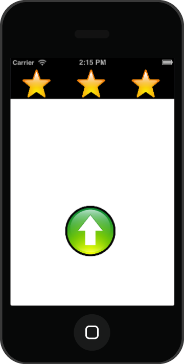
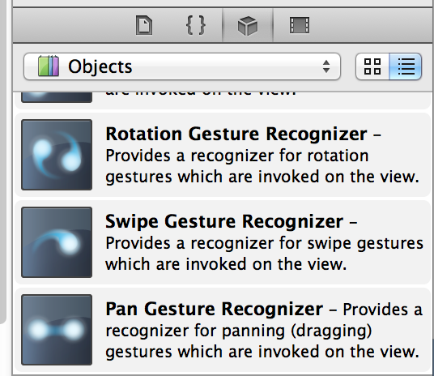
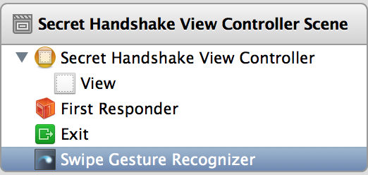
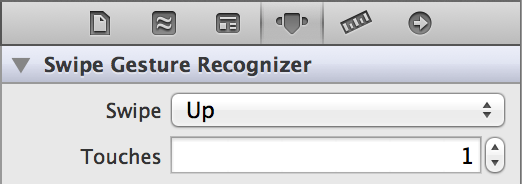
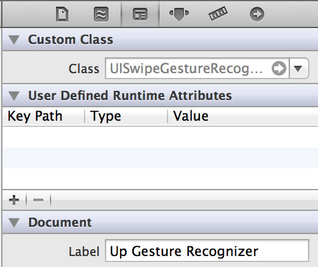
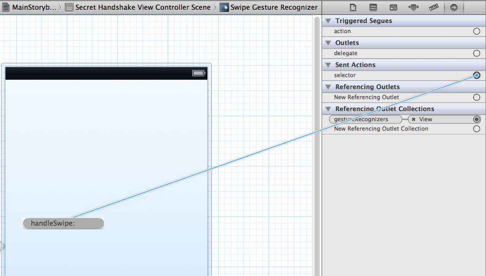
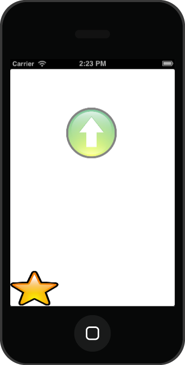
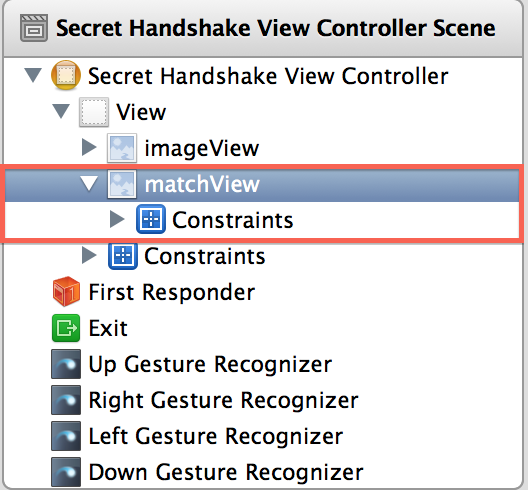

Gestures With a Secret Handshake
================================

Goals of this Lab!
------------------

-   Using gestures to enable a secret handshake lock for our app.

-   Defining your own secret handshake and displaying a message when it
    is entered successfully.

The end result should look something like this:



Part 1
------

In this part we will just be doing the basic setup which will recognize
a single gesture.

### Steps

1.  Create a new program with the name <tt>SecretHandshake</tt> and implement the
    same settings we have been using.

2.  We will now want to add a new method that will recognize and handle
    swiping. To do this first open up your <tt>SecretHandshakeViewController</tt>
    file and add the following method. Once we do this we can manipulate
    it for future responses:
    ```swift
    @IBAction func handleSwipes(sender: UISwipeGestureRecognizer) {
        if sender.direction == .up {
            print("Up swipe!") 
        } else { 
            print("Not up swipe!")
        }
    }
    ```

3.  The following are the steps required to add a gesture to your
    storyboard:

    1.  Drag a swipe gesture recognizer onto the main view from your
        Object Library.

        

    2.  In the Document outline select the gesture recognizer

        

    3.  In the Attributes Inspector change Swipe: to Up

        

    4.  In the Identity Inspector change Document Label to \"Up Gesture
        Recognizer\"

        

    5.  In the Connections Inspector drag from \"Sent Actions\"
        $\rightarrow$ \"Selector\" to the controller and select
        \"handleSwipesWithSender:\"

        

4.  At this point you should be able to swipe up and you will see a
    message appear for the direction you moved (\"Up swipe!\"). A swipe
    is a quick movement of the finger on the screen and if you don't see
    anything happen when swiping up try swiping left, right, and down
    just in case.

    -   Debugging: if it works on one of the other swipe directions then
        the <tt>Attribute Inspector</tt> step was probably skipped. If it doesn't
        work in any direction then the <tt>Selector</tt> might not be attached
        properly. If neither of those solve your problem raise your hand
        and we will be over to help resolve the issue.

    -   Verify that the previous step works properly before continuing
        forward. Our next step will change the debug message (\"Up
        swipe!\") to be a visible icon on the screen.

5.  Add the resource files for this project. There should be four
    directional arrows, a check_mark, and an x_mark.

    -   Note: to make this next step work we are going to need to create
        an image view inside of our scene. Once we have this image view,
        our code will be able to move it around and change the image
        shown. With that in mind we can use the one image view to do a
        wide variety of tasks!

6.  Now you will want to open up the storyboard and do the following:

    1.  Drag out a new Image View from the Object Library at the bottom
        right of the screen.

    2.  Open the assistant editor and then right-click &rarr;
        drag from the new image view onto the code shown. In the pop-up
        set the name to be <tt>imageView</tt> and then press connect.

    The image view can now be accessed from your code; the next step
    will be to place an image and animate it.

7.  Now we will be placing the method that is necessary for animating
    the image view. Inside of your <tt>SecretHandshakeViewController</tt> file
    insert the following method:
    ```swift
    func drawImageForGestureRecognizer(imageName: String, atPoint: CGPoint) {
        print(imageName)
        self.imageView.image = UIImage(named: imageName)
        self.imageView.center = atPoint
        self.imageView.alpha = 1.0
    }
    ```

8.  Make sure to also update your <tt>handleSwipes</tt> method that we added
    earlier as follows:
    ```swift

    @IBAction func handleSwipes(sender: UISwipeGestureRecognizer) {
        
        var image = "Incorrect.png"
        
        let startLocation = sender.location(in: self.view)
        
        var endLocation = startLocation
        
        if sender.direction == .up {
            image = "Up.png"
            endLocation.y -= 220.0
            print("Up swipe!")
        } else {
            print("Not up swipe!")
        }

        self.drawImageForGestureRecognizer(imageName: image, atPoint: startLocation)
        
        UIView.animate(withDuration: 0.5, animations: {
            self.imageView.alpha = 0.0
            self.imageView.center = endLocation
        });
    }
    ```

    9.  Once everything is working commit your project to git!

    Part 2
    ------

    In this part we are going to recognize all swipes and we will implement
    some simple images to allow our users to know that their swipes have
    been recognized!

    ### Steps

    1.  The first thing that we will need to do is add more gesture
        recognizers. Repeat the steps that are listed above for the Up
        gesture three more times; once for left, right, and down. (Make sure
        they are all linked to the same <tt>handleSwipes</tt> method from earlier!).

    2.  Now that you have done that you will need to also update the
        <tt>handleSwipes</tt> method as shown below:

    ```swift
    if sender.direction == .up {
        image = "Up.png"
        endLocation.y -= 220.0
    }
    else if sender.direction == .down {
        image = "Down.png"
        endLocation.y += 220.0
    }
    else if sender.direction == .left {
        image = "Left.png"
        endLocation.x -= 220.0
    }
    else if sender.direction == .right {
        image = "Right.png"
        endLocation.x += 220.0
    } else {
        print("Unrecognized swipe!")
    }

    ```

    Note: We need the extra conditions so that we can match all
    directional possibilities!

3.  Try running the code now and you should be able to see an arrow in
    each direction that you swipe. If you get the X icon then one of the
    swiped directions isn't configured properly. Commit everything to
    your git once it is working as intended!

Part 3
------

In this part we will implement the logic that will be able to store and
match the secret handshake that the user enters. If it is entered
correctly then we will set an icon indicating a successful match and if
a gesture is entered incorrectly then we will place a different icon.
After this part your app should look similar to this:



### Steps

1.  First we will need a new <tt>ImageView</tt> that can show the current state
    of the matching. To do this open the storyboard and do the
    following:

    1.  Drag out a new Image View from the Object Library at the bottom
        right.

    2.  Open the assistant editor at the top right and then use a right
        click &rarr; drag from the new image view onto the code
        show. In the pop-up set the name to be <tt>matchView</tt> and then press
        connect.

2.  In <tt>SecretHandshakeViewController</tt> add the following lines just inside
    the class definition:
```swift
    var secretHandshake = Array<String>() 
    var currentStep = 0
```

    Note: these new variables will be used to store our secret handshake
    and also how close we are to matching the handshake.

3.  Still inside this file we want to define the following method:

```swift
func updateMatchStatus() {
    if currentStep == 0 {
        // No successful matches
        self.match  View.image = UIImage(named: "Incorrect.png")
    }
    else if currentStep < secretHandshake.count {
        // At least 1 gesture matched, but there are more...
        self.matchView.image = UIImage(named: "Matching.png")
    }
    else {
        // Matched all the gestures!
        self.matchView.image = UIImage(named: "Correct.png")
        currentStep = 0
    }
}

```

4.  Our next step will be to update the <tt>handleSwipes</tt> method one final
    time. Replace the contents so that it looks like below:

```swift

@IBAction func handleSwipes(sender: UISwipeGestureRecognizer) {
    var image = "Incorrect.png"
    
    let startLocation = sender.location(in: self.view)
    
    var endLocation = startLocation
    
    if sender.direction == .up {
        image = "Up.png"
        endLocation.y -= 220.0
        print(secretHandshake)
        if secretHandshake[currentStep] == "UP" {
            currentStep += 1
        } else {
            currentStep = 0
        }
    }
    else if sender.direction == .down {
        image = "Down.png"
        endLocation.y += 220.0
        if secretHandshake[currentStep] == "DOWN" {
            currentStep += 1
        } else {
            currentStep = 0
        }
    }
    else if sender.direction == .left {
        image = "Left.png"
        endLocation.x -= 220.0
        if secretHandshake[currentStep] == "LEFT" {
            currentStep += 1
        } else {
            currentStep = 0
        }
    }
    else if sender.direction == .right {
        image = "Right.png"
        endLocation.x += 220.0
        if secretHandshake[currentStep] == "RIGHT" {
            currentStep += 1
        } else {
            currentStep = 0
        }
    }
    else {
        print("Unrecognized swipe!")
    }
    
    self.handshakeMatcher.correctGuesses = currentStep
    self.navigationController?.setNavigationBarHidden(false, animated: false)
    
    
    
    self.drawImageForGestureRecognizer(imageName: image, atPoint: startLocation)
    
    UIView.animate(withDuration: 0.5, animations: {
        self.imageView.alpha = 0.0
        self.imageView.center = endLocation
    });
    
    self.updateMatchStatus()
}

```

5.  This final step is where all the magic happens in our program. Up
    until now we've written code to manage our handshake once we've told
    the computer what it is, now we will define what our handshake is.
    Inside the file modify the viewDidLoad method with the following:
    ```swift
    override func viewDidLoad() {
        super.viewDidLoad()
        self.secretHandshake = ["LEFT", "LEFT", "UP"]
    }
    ```

6.  Test out the one listed above to confirm everything works and then
    create your own secret handshake! Remember that the commands needed
    have to match what is in the gesture recognizer. (They are UP, DOWN,
    LEFT, and RIGHT)

7.  Once everything is working commit your project to git!

Part 4
------

The previous part of the lab allowed you to see if each individual guess
was correct, but there was no overall progress of the handshake shown.
With this final part of the lab we will add a box at the top of the
window and it will track our progression towards the secret handshake
(shown below).


### Steps

1.  The first thing we want to do is add the new file that will be used
    for the current progress.

    -   Click on File &rarr; New &rarr; File.

    -   Confirm Cocoa Touch is selected on the left under iOS and then
        make sure Cocoa Touch class is selected.

    -   Click next and then name the class <tt>HandshakeMatches</tt> with <tt>UIView</tt> selected for Subclass of.

    -   Save the file to the project folder and create!

2.  It is smart now to remove some information from the previous parts
    to save memory and make it easier to understand. (It also won't show
    multiple match status updates) Below are the things that should be
    removed from the code for ease:

    1.  The entire method <tt>updateMatchStatus</tt>.

    2.  The call <tt>self.updateMatchStatus()</tt> at the bottom of the
        handleSwipe method inside of the same class.

    3.  The <tt>ImageView matchView</tt> should be removed from the storyboard.

        

    4.  Now we want to add the appropriate properties to our new file
        <tt>HandshakeMatches</tt>. Below are the properties that should be added:

    ```swift
    var incorrectImage = UIImage()
    var matchingImage = UIImage()
    var correctImage = UIImage()
    
    var imageViews = Array<UIImage>()
    
    var numberOfGestures = 0 
    var correctGuesses = 0
    
    var midMargin = 0
    var leftMargin = 0
    var minImageSize = CGSize()
    ```

    Note: these properties are all the images that will be utilized for
    our progress bar. We also create an array of image views (3
    pictures) that are managed by the bar. The next two properties are
    used to determine how many gestures there are and how many are
    correct. The last three properties adjust the margins of the black
    box and the guess images.

3.  Once the header file has been edited to implement the images we will
    manipulate the <tt>HandshakeMatches</tt> file to add some more information.
    We need to add a new method that is going to be called, this method
    explains to the computer what the variables actually represent. Add
    the following method to this file:

    ```swift
    func baseInit() {
        self.incorrectImage = UIImage(named: "Incorrect.png")!
        self.correctImage = UIImage(named: "Correct.png")!
        self.matchingImage = UIImage(named: "Matching.png")!
        self.midMargin = 5
        self.leftMargin = 0
        self.minImageSize = CGSize(width: 5, height: 5)
        self.numberOfGestures = 5
        print("Handshake matches initialized!")
    }
    ```

4.  The next thing we are going to do is make sure we call our <tt>baseInit</tt>
    method. So that being said, change this method to look like below:

    ```swift
    override init(frame: CGRect) {
        super.init(frame: frame)
        self.baseInit()
    }    
    ```

5.  We want to add another method to the <tt>HandshakeMatches</tt> file that is
    generally used for initializing information with a decoder, but it
    is still important to add in your code in case it is necessary for
    future usage (and is required in Swift):

    ```swift
    required init?(coder aDecoder: NSCoder) {
        super.init(coder: aDecoder)
        self.baseInit()
    }
    ```

6.  Now we will edit the <tt>drawRect</tt> method that is present in this file
    and also uncomment it by deleting the <tt>/\*</tt> and the <tt>\*/</tt>. Include the
    following information so your drawRect looks like below:

    ```swift
    override func draw(_ rect: CGRect) {
        self.refresh()
        let desiredImageWidth = (self.frame.size.width - CGFloat(self.leftMargin*2) - CGFloat(self.midMargin*self.imageViews.count)) / CGFloat(self.imageViews.count)
        let imageWidth = max(self.minImageSize.width, desiredImageWidth)
        let imageHeight = max(self.minImageSize.height, self.frame.size.height)
        for i in 0...self.imageViews.count-1 {
            let imageView = self.imageViews[i]
            let imageFrame = CGRect(x: CGFloat(self.leftMargin) + CGFloat(i)*(CGFloat(self.midMargin)+imageWidth), y: 0, width: imageWidth, height: imageHeight)
            imageView.frame = imageFrame
        }
    }
    ```

7.  Once that is finished there are quite a few more methods that need
    to be added for usability of the application. Below is the method
    (by modifying the <tt>numberOfGestures</tt> variable) that sets how many
    gestures need to be done correctly to move on, and if the number of
    gestures is not at the max (3 in this case), it will reset to 0.

    ```swift
    var numberOfGestures: Int = 0 {
        didSet {
            for imageView in self.imageViews {
                imageView.removeFromSuperview()
            }
            self.imageViews.removeAll()
            
            // Add new image views
            for _ in 1...numberOfGestures {
                let imageView = UIImageView()
                imageView.contentMode = UIView.ContentMode.scaleAspectFit
                self.imageViews.append(imageView)
                self.addSubview(imageView)
            }
            
            self.setNeedsLayout()
            self.setNeedsDisplay()
        }
    }
    ```

8.  We now need to refresh the information and check whether it is
    correct or incorrect and adjust the image as appropriate.

    ```swift
    func refresh() {
        for i in 0...self.imageViews.count-1 {
            let imageView = self.imageViews[i]
            if self.correctGuesses >= i+1 {
                imageView.image = self.correctImage
            }
            else {
                imageView.image = self.matchingImage
            }
        }
    }
    ```

9.  Now the box is actually created and the sub-images are created
    inside of it. Below is the next method that should be added.

    ```swift
    override func layoutSubviews() {
        super.layoutSubviews()
        let desiredImageWidth = (self.frame.size.width - CGFloat(self.leftMargin*2) - CGFloat(self.midMargin*self.imageViews.count)) / CGFloat(self.imageViews.count)
        let imageWidth = max(self.minImageSize.width, desiredImageWidth)
        let imageHeight = max(self.minImageSize.height, self.frame.size.height)
        for i in 0...self.imageViews.count-1 {
            let imageView = self.imageViews[i]
            let imageFrame = CGRect(x: CGFloat(self.leftMargin) + CGFloat(i)*(CGFloat(self.midMargin)+imageWidth), y: 0, width: imageWidth, height: imageHeight)
            imageView.frame = imageFrame
        }
    }
    ```

10. The last three methods that are added to HandshakeMatches are below.
    It notates if it was a correct or incorrect match. And then also how
    many guesses are correct so far. Note that we are modifying the
    declaration for correctGuesses.
    ```swift
    func notateIncorrectMatch() {
        self.correctGuesses = 0
        self.setNeedsDisplay()
    }

    func notateCorrectMatch() {
        self.correctGuesses += 1
        self.setNeedsDisplay()
    }
    var correctGuesses: Int = 0 {
        didSet {
            self.refresh()
            self.setNeedsDisplay()
        }
    }
    ```

11. Now you do not have to worry about the <tt>HandshakeMatches</tt> files
    anymore, but we do need our view controller to reference these
    files. Add the below variable:

    ```swift
        @IBOutlet weak var handshakeMatcher: HandshakeMatches!
    ```

Note: this is important to add because we need to be able to use the
<tt>HandshakeMatches</tt> files inside of our view controller, but we have no
reference to the files. So, we create an outlet of the file itself.

12. In this file you will want to add a new method which is similar to
    our <tt>viewDidLoad</tt> as in it gets called at the beginning of the
    application. Below is the method that gets added:

    ```swift
    override func viewDidAppear(_ animated: Bool) {
        super.viewDidAppear(animated)
        let handshakeMatcher = HandshakeMatches(frame: CGRect(x: 0, y: 0, width: self.view.bounds.size.width, height: 60))
        self.handshakeMatcher = handshakeMatcher
        self.view.addSubview(self.handshakeMatcher)
        self.handshakeMatcher?.numberOfGestures = self.secretHandshake.count
    }
    ```
Note: this is the actual call that sets the boundaries for the black
box.

13. The very last thing that needs to be done is call <tt>handshakeMatcher</tt>
    and tell it how many correct guesses there have been. Inside of our
    <tt>handleSwipe</tt> method, at the very end, we want to add the below
    statement which will make the appropriate call:

    ```swift
    self.handshakeMatcher.correctGuesses = currentStep
    ```

14. Run the program and see if it works! It will now show you when
    you've completed each part of the handshake. But it isn't quite
    finished yet in the sense that once you get 3 guesses correct, you
    can not do anything else! We have one more part to this lab which
    implements what we've learn in a couple previous labs.

15. We are going to be adding a new view controller which is our
    \"congratulations\" screen, and then we need to add a navigation
    controller to go back to the first view controller. Here are the
    steps that need to be completed so our application allows for
    replay, which was outlined in a previous lab:

    1.  Return to the storyboard and drag out a new view controller and
        put this on to the right of the view controller that already
        exists. Convention says that the views should flow from a master
        on the left to later views on the right. On this new view
        controller add a label and a button. Change the label text to
        something like \"great job!\", and change the button text to
        \"Play Again!\". We will use this button to return to the
        previous view and reinitialize the positions.

    2.  The next thing we will want to do is to add a new class to back
        this view controller. (Add a new class with the same steps from
        earlier except you want to name it <tt>VictoryViewController</tt> and
        have it be a subclass of <tt>UIViewController</tt>, *NOT UIView*!)

    3.  After this select the new view controller and go into your
        <tt>Identity Inspector</tt> and make its class be <tt>VictoryViewController</tt>.
        This will connect the new view controller with your new class.

    4.  Once you have set and connect the backing class make sure to
        connect the button to the header file (also make sure it is an
        action)! Name it something simple like <tt>playAgain</tt>.

    5.  Then we need to define a <tt>Push Segue</tt> between the two views. This
        just defines the ability of one view controller to cause another
        view controller to be the active view controller. To implement
        the segue right-click and drag from the top bar of one view
        controller anywhere onto another view controller.

    6.  Embed <tt>SecretHandshakeViewController</tt> in a Navigation Controller.
        After doing so, in your <tt>SecretHandshakeViewController</tt>'s  <tt>viewDidLoad</tt> method insert:
        ```swift
        self.navigationController?.setNavigationBarHidden(false,
        animated: false) 
        ```

    7.  Select the segue (arrow in-between the two view controllers) and
        go to the <tt>Attributes Inspector</tt> and then name your new segue
        <tt>segueToVictory</tt> where it says Identifier. We will call this from
        the code when the user gets three correct guesses. Before we
        update that, let's write out <tt>VictoryViewController.swift</tt>: you
        should edit the <tt>playAgain</tt> method to look like the following
        code:
        ```swift
        @IBAction func playAgain(sender: AnyObject) {
            self.navigationController?.popViewControllerAnimated(true)
        }
        ``` 

    8.  The very last thing we need to do is check if the three gestures
    are correct, which should unlock the secret handshake and move
    to the next view. We also have to reset the number of guessed
    gestures. Go back into your <tt>SecretHandshakeViewController</tt> file
    and go to the bottom of the <tt>handleSwipe</tt> method. Right after we
    call <tt>handshakeMatcher</tt> we will add the following lines:

        ```swift
        if currentStep == 3 currentStep = 0
        self.performSegueWithIdentifier(\"segueToVictory\", sender:
        self)
        ```

16. Now everything should work and allow you to replay your secret
    handshake. Don't forget to commit to git once you have finished! If
    your program does not work, please raise your hand and we will be
    over to assist you!
 

    Congratulations!

    You have finished your Secret Handshake lab!
